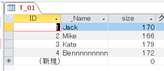
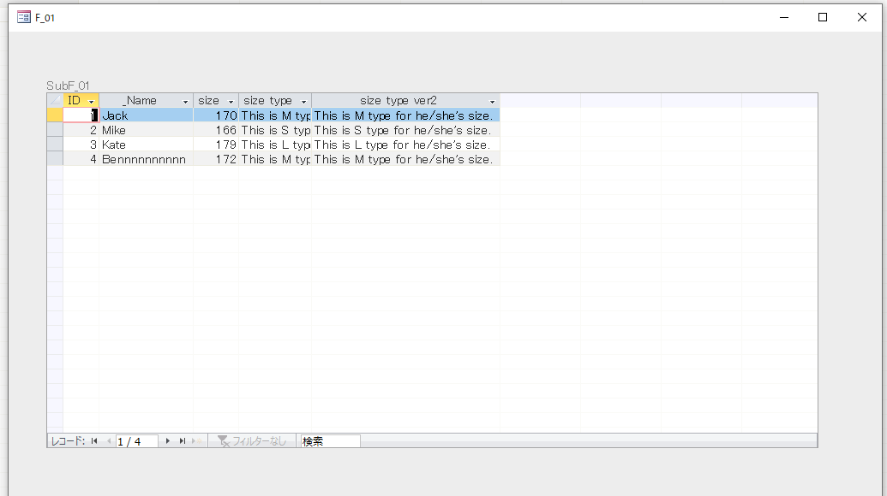
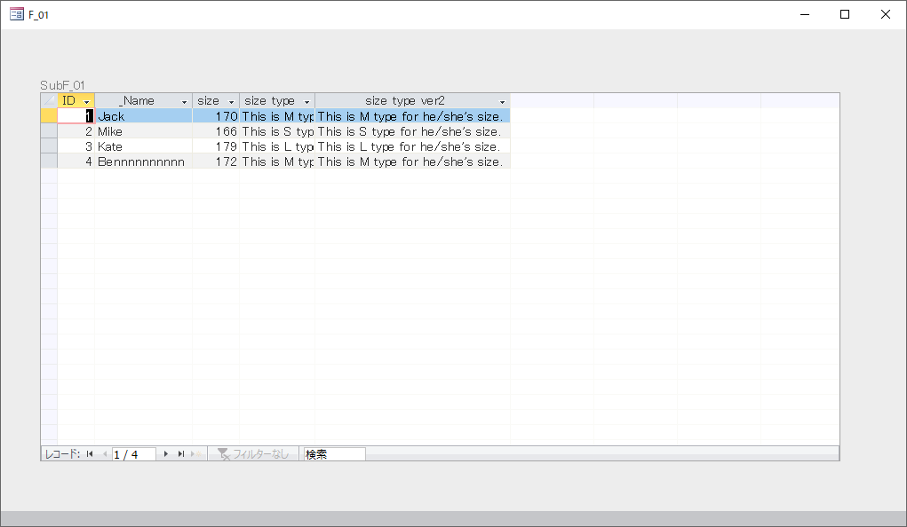



## ABOUT THIS ARTICLE

When using a datasheet type form in MSAccess,  
in case we assign a user defined function which returns a string to the control source of textbox,  
the problem happens that the Automatic adjustment of column width of the form doesn't work as expected.

For example, if a long string is returned from user defined function, the string doesn't fit in the field and is cut off.

As seen below, I have researched the solution.


## TL;DR

The timing of calling use defined function is later than the execution of 'Resize' procedure of the Form,  
So automatic adjustment for target Textbox by following process is not working.


```vb
Private Sub Form_Resize()
    
    '...code

    ctl.ColumnWidth = -2
    
    '...code

End Sub
```

Therefore, one of the following solutions must take place.  
- Create a function where `Control.ColumnWidth = -2` is added to the conventional process of user defined function.
- Assign the length explicitly when run `Resize`.

## MAIN

### PREMISE

There is a table named T_01 like:  


Suppose a following form named F_01, integrating above table, will be displayed.  


Under these conditions, it is desired that the column widths of each column ID, _Name, and size are automatically adjusted.  
Also, I would like to add a new 'size tyep' text column, and store the string "This is 'X' type for he/she's size." which indicates the size symbol of S, M, or L for each value of size. The column is desired to be adjusted, too.


### VERIFICATION ENVIRONMENT
Microsoft Access 2019


### IMPLEMENT

I've assigned a column width for each textbox in `Resize` procedure of subform.  
For automatic adjustment, `ColumnWidth` property is to be assign to -2.

```vb
Private Sub Form_Resize()
    
    'Const
    Const FUNC_NAME As String = "Form_Resize"
    
    'Variable
    Dim ctl As Access.Control
    
    On Error GoTo ErrorHandler
    
    For Each ctl In Me.Controls
        If ctl.ControlType = acTextBox Then
            ctl.ColumnWidth = -2
        End If
    Next
    
ExitHandler:

    Exit Sub
    
ErrorHandler:

    MsgBox "An error has occurred and the macro will be terminated." & _
           vbLf & _
           "Func Name:" & FUNC_NAME & _
           vbLf & _
           "Error No." & Err.Number & vbNewLine & _
           Err.Description, vbCritical, TOOL_NAME
        
    GoTo ExitHandler
        
End Sub
```

Also, to the column of size type text, I would like to assign S, M, and L size symbol for each range of size value.

So I've assigned following formula to the control source of the textbox and created the user defined function `getSizeType`.


```
# control source formula
=getSizeType([size])
```

```vb
'******************************************************************************************
'*Function      :get size type
'*arg(1)        :size number
'*return        :size type
'******************************************************************************************
Public Function getSizeType(ByVal sizeNum As Long) As String
    
    'Const
    Const FUNC_NAME As String = "getSizeType"
    
    'Variable
    Dim rtn As String
    
    On Error GoTo ErrorHandler
    
    getSizeType = ""
    
    '-169      :S
    '170-175   :M
    '-176      :L
    Select Case True
    Case sizeNum < 169
        rtn = "This is S type for he/she's size."
    Case 176 < sizeNum
        rtn = "This is L type for he/she's size."
    Case Else
        rtn = "This is M type for he/she's size."
    End Select

    getSizeType = rtn
    
ExitHandler:

    Exit Function
    
ErrorHandler:

    MsgBox "An error has occurred and the macro will be terminated." & _
           vbLf & _
           "Func Name:" & FUNC_NAME & _
           vbLf & _
           "Error No." & Err.Number & vbNewLine & _
           Err.Description, vbCritical, TOOL_NAME
        
    GoTo ExitHandler
        
End Function
```


### TROUBLE

#### CUTOFF OF SCREEN

The column widths of the existing fields in the table, ID, _Name, and size, are adjusted correctly.   
But column width of size type is cut off.

As its width is too long, I expected it would be adjusted in `Form_Resize()`, but not working.


#### CAUSE: THE ORDER OF CALLING FUNCTIONS

When debugging that procedure,   
it turned out that the calling order of functions was (1) subform Form_Resize → (2) parent form Form_Resize → (3) getSizeType.


### SOLUTION

#### 1. MODIFICATION OF USER DEFINED FUNCTION

Since `Form_Resize()` cannot handle it, it is necessary to add `Control.ColumnWidth = -2` to the processing of the user defined function.

So I've created a new function `getSizeTypeForSubF01Tb()` which wraps `getSizeType()`, and for comparison, created a new text box 'size type ver2' with having another control source.


```
# control source formula
=getSizeTypeForSubF01Tb([size],"txtSizeTypeVer2")
```

```vb
'******************************************************************************************
'*Function      :get size type for subF01
'*arg(1)        :size number
'*arg(2)        :control name
'*return        :size type
'******************************************************************************************
Public Function getSizeTypeForSubF01Tb(ByVal sizeNum As Long, ByVal ctlName As String) As String
    
    'Const
    Const FUNC_NAME As String = "getSizeTypeForSubF01Tb"
    
    'Variable
    Dim rtn As String
    
    On Error GoTo ErrorHandler
    
    getSizeTypeForSubF01Tb = ""
    
    rtn = Module_ManageFormControls.getSizeType(sizeNum)

    'Reconfigure the column width
    If SysCmd(acSysCmdGetObjectState, acForm, Form_F_01.Name) <> 0 Then Form_SubF_01.Controls(ctlName).ColumnWidth = -2

    getSizeTypeForSubF01Tb = rtn
    
ExitHandler:

    Exit Function
    
ErrorHandler:

    MsgBox "An error has occurred and the macro will be terminated." & _
           vbLf & _
           "Func Name:" & FUNC_NAME & _
           vbLf & _
           "Error No." & Err.Number & vbNewLine & _
           Err.Description, vbCritical, TOOL_NAME
        
    GoTo ExitHandler
        
End Function
```

As a result, Automatic column width adjustment now works for size type ver2 as well.




#### 2. ASSIGN THE LENGTH EXPLICITLY

Inside `Form_Resize()`, I hardcoded the column width numbers of some of control after the column width auto-adjustment loop.


```vb
Private Sub Form_Resize()
    
    'Const
    Const FUNC_NAME As String = "Form_Resize"
    
    'Variable
    Dim ctl As Access.Control
    
    On Error GoTo ErrorHandler
    
    'the loop
    For Each ctl In Me.Controls
        If ctl.ControlType = acTextBox Then
            ctl.ColumnWidth = -2
        End If
    Next

    'assign the column width of size type ver2 explicitly (more than 8 cm)
    if Me.txtSizeTypeVer2.ColumnWidth < 8 * 567 then Me.txtSizeTypeVer2.ColumnWidth = 8 * 567
    
ExitHandler:

    Exit Sub
    
ErrorHandler:

    MsgBox "An error has occurred and the macro will be terminated." & _
           vbLf & _
           "Func Name:" & FUNC_NAME & _
           vbLf & _
           "Error No." & Err.Number & vbNewLine & _
           Err.Description, vbCritical, TOOL_NAME
        
    GoTo ExitHandler
        
End Sub
```

The automatic adjustment is fine as well.


#### COMPARISON OF 1 AND 2

Method 1 doesn't increase the function number, but with width to be hardcoded,   
make the tool need to be maintained when the string returned by `getSizeType()` changes.

Method 2 enables all the widths to be auto-adjusted,   
but increases the function number and makes the processing of the control source a little complicated.


