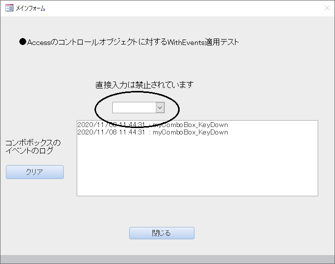
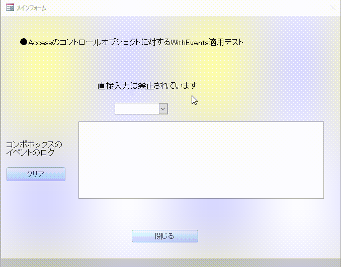
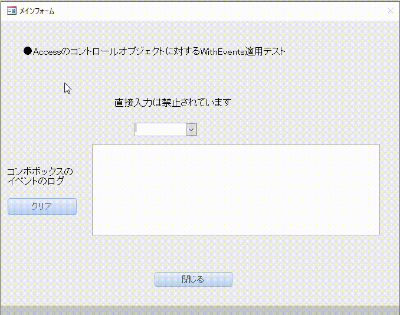

## この記事について

Accessでフォーム上のコントロール（テキストボックス、コンボボックスなど）で、
イベント処理を共通化するためにWithEventsステートメントを用いてイベントリスナークラスを作成することを考える。

その際に、ExcelでWitheventsを使用するときと同じようなコードで作成すると、  
せっかく設定したクラス側のイベントが発火してくれない事態が生じた。

その事例と、講じた対策二種類について記したい。

[説明のために作成したAccessファイルとソースコードはこちらでダウンロードできます。](https://github.com/dede-20191130/My_VBA_Tools/tree/master/Public/2020/11/Access-Control-WithEvents)

## 事例

次のような画面とコードで、  
丸囲みのコンボボックスをキーボード入力できないようにする。    
（先に<span style="color: red; ">正常に動かない</span>コードのほうを示す）

共通化のために、  
コンボボックスのKeyDownイベント関数をクラス化する。

検証のために、コンボボックスのイベント発火をトレースし、  
テキストボックスにログを出力できるようにした。

### 画面



### オブジェクトのプロパティ


|名前|種類|説明|
|--|--|--|
|cmb_withEventsTest|コンボボックス|直接のキーボード入力を禁止する|
|txt_EventLog|テキストボックス|コンボボックスの<br>イベントログが表示される|

### コード

下記コードは<span style="color: red; ">正常に動かない</span>（myComboBox_KeyDown関数が発火しない）

#### フォームモジュール：MainForm

```vb
Option Compare Database
Option Explicit

'**************************
'*MainForm
'**************************

'定数


'変数
Private objCmbListener As clsCmbListener


'******************************************************************************************
'*getter/setter
'******************************************************************************************


'******************************************************************************************
'*関数名    ：Form_Load
'*機能      ：
'*引数(1)   ：
'******************************************************************************************
Private Sub Form_Load()
    
    '定数
    Const FUNC_NAME As String = "Form_Load"
    
    '変数
    Dim dicInfo As Object
    
    On Error GoTo ErrorHandler

    'イベントクラス設定
    Set objCmbListener = New clsCmbListener: Set objCmbListener.ComboBox = Me.cmb_withEventsTest
    'イベントログ設定
    Set M_EventLog.targetTxtBox = Me.txt_EventLog
    
ExitHandler:

    Exit Sub
    
ErrorHandler:

    MsgBox "エラーが発生したため、マクロを終了します。" & _
           vbLf & _
           "関数名：" & FUNC_NAME & _
           vbLf & _
           "エラー番号：" & Err.Number & vbNewLine & _
           Err.Description, vbCritical, "Access-Control-WithEvents"
        
    GoTo ExitHandler
        
End Sub


'******************************************************************************************
'*関数名    ：cmb_withEventsTest_BeforeUpdate
'*機能      ：
'*引数(1)   ：
'******************************************************************************************
Private Sub cmb_withEventsTest_BeforeUpdate(Cancel As Integer)
    
    '定数
    Const FUNC_NAME As String = "cmb_withEventsTest_BeforeUpdate"
    
    '変数
    
    On Error GoTo ErrorHandler

    'ログに記入
    If Not M_EventLog.writeEventLogs(FUNC_NAME) Then GoTo ExitHandler

ExitHandler:

    Exit Sub
    
ErrorHandler:

    MsgBox "エラーが発生したため、マクロを終了します。" & _
           vbLf & _
           "関数名：" & FUNC_NAME & _
           vbLf & _
           "エラー番号：" & Err.Number & vbNewLine & _
           Err.Description, vbCritical, "Access-Control-WithEvents"
        
    GoTo ExitHandler
        
End Sub


'******************************************************************************************
'*関数名    ：cmb_selectedRcd_AfterUpdate
'*機能      ：
'*引数(1)   ：
'******************************************************************************************
Private Sub cmb_withEventsTest_AfterUpdate()
    
    '定数
    Const FUNC_NAME As String = "cmb_selectedRcd_AfterUpdate"
    
    '変数
    
    On Error GoTo ErrorHandler
    
    'ログに記入
    If Not M_EventLog.writeEventLogs(FUNC_NAME) Then GoTo ExitHandler
    If Not M_EventLog.writeEventLogs("""" & Me.cmb_withEventsTest.Value & """" & "Selected") Then GoTo ExitHandler

ExitHandler:

    Exit Sub
    
ErrorHandler:

    MsgBox "エラーが発生したため、マクロを終了します。" & _
           vbLf & _
           "関数名：" & FUNC_NAME & _
           vbLf & _
           "エラー番号：" & Err.Number & vbNewLine & _
           Err.Description, vbCritical, "Access-Control-WithEvents"
        
    GoTo ExitHandler
        
End Sub


```

<br><br>
#### クラス：clsCmbListener

```vb
Option Compare Database
Option Explicit

'**************************
'*コンボボックスイベントリスナー
'**************************

'定数

'変数
Private WithEvents myComboBox As Access.ComboBox

'******************************************************************************************
'*getter/setter
'******************************************************************************************
Public Property Set ComboBox(ByRef cmb As Access.ComboBox)
    Set myComboBox = cmb
End Property


'******************************************************************************************
'*関数名    ：myComboBox_KeyDown
'*機能      ：キー入力を無効にする
'*引数(1)   ：
'******************************************************************************************
Private Sub myComboBox_KeyDown(KeyCode As Integer, Shift As Integer)
    
    '定数
    Const FUNC_NAME As String = "myComboBox_KeyDown"
    
    '変数
    
    On Error GoTo ErrorHandler
    
    'キー入力を無効にする(Enter/Tab/Esc以外)
    If KeyCode = vbKeyReturn Then GoTo ExitHandler
    If KeyCode = vbKeyTab Then GoTo ExitHandler
    If KeyCode = vbKeyEscape Then GoTo ExitHandler
    
    KeyCode = 0
    
    If Not M_EventLog.writeEventLogs(FUNC_NAME) Then GoTo ExitHandler
    
ExitHandler:

    Exit Sub
    
ErrorHandler:

    MsgBox "エラーが発生したため、マクロを終了します。" & _
           vbLf & _
           "関数名：" & FUNC_NAME & _
           vbLf & _
           "エラー番号：" & Err.Number & vbNewLine & _
           Err.Description, vbCritical, "Access-Control-WithEvents"
        
    GoTo ExitHandler
        
End Sub


```

<br><br>
#### モジュール：M_EventLog

```vb
Option Compare Database
Option Explicit


'**************************
'*イベントログModule
'**************************

'定数


'変数
Public targetTxtBox As Access.TextBox


'******************************************************************************************
'*関数名    ：writeEventLogs
'*機能      ：テキストボックスにイベントログを書き込む
'*引数(1)   ：記入文字列
'*戻り値    ：True > 正常終了、False > 異常終了
'******************************************************************************************
Public Function writeEventLogs(ByVal logTxt As String) As Boolean
    
    '定数
    Const FUNC_NAME As String = "writeEventLogs"
    
    '変数
    
    On Error GoTo ErrorHandler

    writeEventLogs = False
    
    If Nz(targetTxtBox.Value, "") <> "" Then targetTxtBox.Value = targetTxtBox.Value & vbNewLine
    targetTxtBox.Value = targetTxtBox.Value & _
                         Now & _
                         " : " & _
                         logTxt
    
    writeEventLogs = True
    
ExitHandler:

    Exit Function
    
ErrorHandler:

    MsgBox "エラーが発生したため、マクロを終了します。" & _
           vbLf & _
           "関数名：" & FUNC_NAME & _
           vbLf & _
           "エラー番号：" & Err.Number & vbNewLine & _
           Err.Description, vbCritical, "Access-Control-WithEvents"
        
    GoTo ExitHandler
        
End Function


```

## トラブル

コンボボックスのKeyDownイベントは、WithEventsによって  
[clsCmbListener]クラスのもつmyComboBox_KeyDown関数で補足され、  
EnterやTabなどの一部のキー以外はキー入力が禁止されるはずである。

ところが、コンボボックスに直接のキーボード入力ができてしまう。



さらに、テキストボックスに  
myComboBox_KeyDown関数が呼出されたログが表示されていないため、  
そもそもWithEventsの想定通りの動作が起こっていないことになる。

ExcelのWithEventsの場合は、上に記したようなコードで動作したため、  
しばらくどう対応したものか悩んだ。

## 解決方法

### i. フォームモジュールの方にもKeyDownイベント関数を追加する

#### 内容

つまり、下記のように処理が空である関数を追加する。

```vb
Option Compare Database
Option Explicit

'**************************
'*MainForm
'**************************

'定数


'変数
Private objCmbListener As clsCmbListener

'~~~~~~~~略~~~~~~~~

Private Sub cmb_withEventsTest_KeyDown(KeyCode As Integer, Shift As Integer)
'
End Sub
```


こうすることで、  
クラスのKeyDownイベントが呼出されるようになった。




#### 問題点

しかし、このやり方には問題がある。

上記のcmb_withEventsTest_KeyDown関数は、  
空欄のままだと  
VBEのデバッグ->コンパイルを実行すると  
VBEが不要とみなして自動的に削除してしまう。

そのため、
あえてコメント行をはさんで削除されないようにしているが、  
コードとしてメンテナンス性に欠ける  
（他の人がこのコードを見たときに、不要とみなして削除してしまうかもしれない）。

```vb
Private Sub cmb_withEventsTest_KeyDown(KeyCode As Integer, Shift As Integer)
'
End Sub
```

### ii. ComboBoxオブジェクト変数のOnKeyDownプロパティに[Event Procedure]と設定する

[参考にしたstackoverflow](https://stackoverflow.com/questions/23522230/creating-a-class-to-handle-access-form-control-events)

stackoverflow中の、
```vb
listener.ct.OnClick = "[Event Procedure]"  '<------- Assigned the event handler
```
の部分で、おそらくこの文言を追加すれば良いのかと思い、    
下記のように、クラスのmyComboBoxのsetterメソッドにおいて  
コードに適用してみた。

```vb
Option Compare Database
Option Explicit

'**************************
'*コンボボックスイベントリスナー
'**************************

'定数

'変数
Private WithEvents myComboBox As Access.ComboBox

'******************************************************************************************
'*getter/setter
'******************************************************************************************
Public Property Set ComboBox(ByRef cmb As Access.ComboBox)
    Set myComboBox = cmb
    myComboBox.OnKeyDown = "[Event Procedure]"
End Property


'~~~~~~~~~以下略~~~~~~~~

```

これで想定通りに動くようになった。
