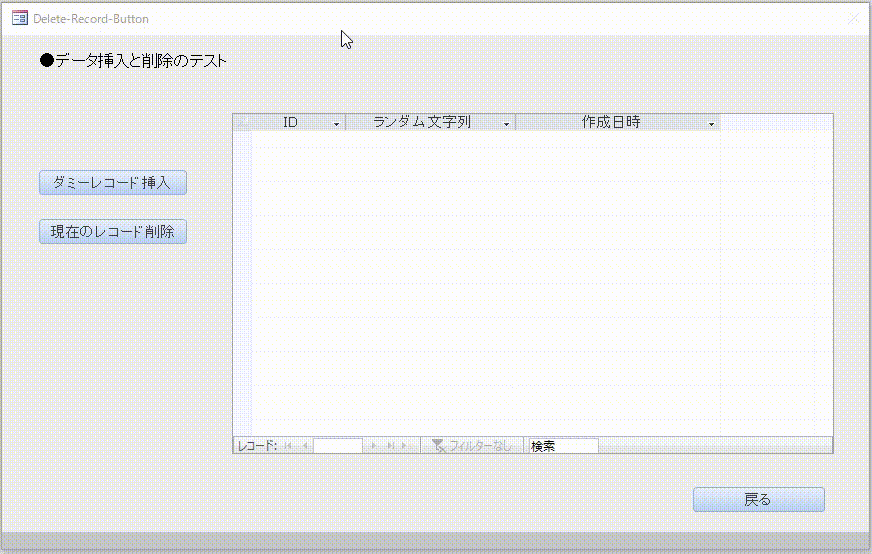
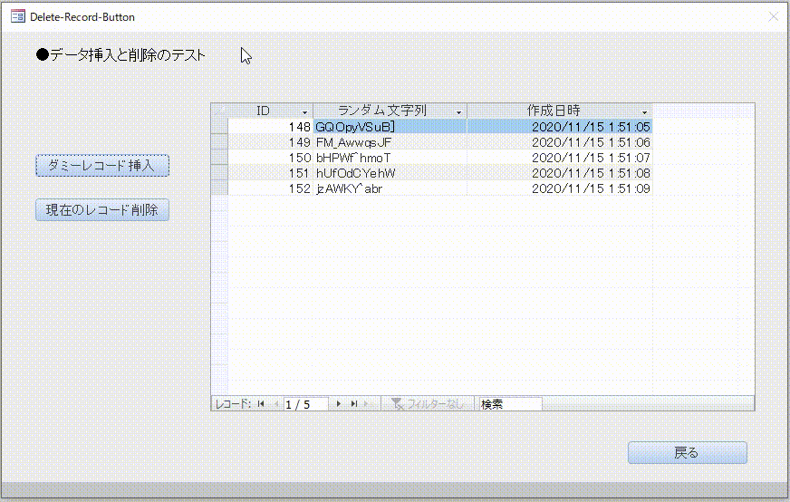

## この記事について

作成動機は、  
下記の記事で起こっていたカレントレコードなしエラー(エラー番号:3021)のケースが  
サブフォームにおいても起こるかどうかを確かめたかったため。  

[■T'sWare Access Tips #674 ～フォームを閉じるときのカレントレコードなしエラーの回避法～](https://tsware.jp/tips/tips_674.htm)

サブフォームに対するレコード削除機能をもたせたテストファイルを作成した。

・・・結果は、サブフォームの場合ではエラーは起こらなかった。  
しかし、上記サイト様のほうで  
> ただし、そのような処理をすると常に発生するわけではなく、  
テーブル/クエリやフォームとのいろいろな条件が揃ったときに発生するようで、  
かなり似た構成の作りであってもエラーが発生しないこともあります。  
またAccessのバージョンやビルドなど一時的な問題の可能性もあります。

とあるように、たまたま私のオブジェクト構成・コードでは起こらなかっただけかもしれない。  

せっかくなので、レコード挿入機能も追加し、  
レコードを挿入、削除する簡単なサンプルコードを持つファイルとして作成し直した。

[<u>ファイルはこちらからダウンロードできます（LINK）。  
また、ソースコードもこちらに置いてあります。</u>](https://github.com/dede-20191130/My_VBA_Tools/tree/master/Public/2020/11/Delete-Record-Button)

## 作成環境
Windows10  
MSOffice 2019

## 動画  

こんな感じ。  

## 終わりに

詳細な動きは、<a href="#srcURL">ソースコード</a>を参照ください。