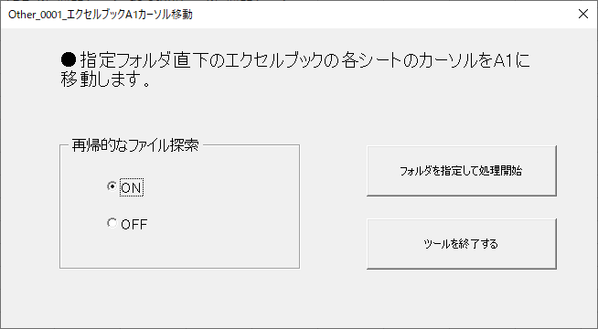

## このツールについて
下記Qiita記事のプログラムを、フォルダ配下のExcelブックに対して再帰的に/非再帰的に適用できるように  
機能をもたせたツールです。  

[<u>記事リンク</u>](https://qiita.com/dede-20191130/items/1fef61cd238e7b724dc1#3-1%E3%82%A8%E3%82%AF%E3%82%BB%E3%83%AB%E3%83%96%E3%83%83%E3%82%AF%E3%81%AE%E4%BD%93%E8%A3%81%E3%82%92%E6%95%B4%E3%81%88%E3%82%8B%E3%83%97%E3%83%AD%E3%82%B0%E3%83%A9%E3%83%A0)

[<u>ツールはこちらからダウンロードできます。  
また、ソースコードもこちらに置いてあります。</u>](https://github.com/dede-20191130/My_VBA_Tools/tree/master/%E3%81%9D%E3%81%AE%E4%BB%96%E3%83%84%E3%83%BC%E3%83%AB/Other_0001_%E3%82%A8%E3%82%AF%E3%82%BB%E3%83%AB%E3%83%96%E3%83%83%E3%82%AFA1%E3%82%AB%E3%83%BC%E3%82%BD%E3%83%AB%E7%A7%BB%E5%8B%95)

## 作成環境
Windows10  
MSOffice 2016

## 機能
- エクセルブックに対して、すべてのシートのカーソルを左上セル（A1セル）に合わせ、一番左のシートをアクティブにした状態にする。  
- ダイアログで選択したフォルダ配下のすべてのエクセルブック（xls,xlsx,xlsm）に対して処理を行う。  
- ファイル探索を再帰的に、または非再帰的に行う

## 画面

|名称|画像|
|--|--|
|**起動後に表示されるフォーム**||

