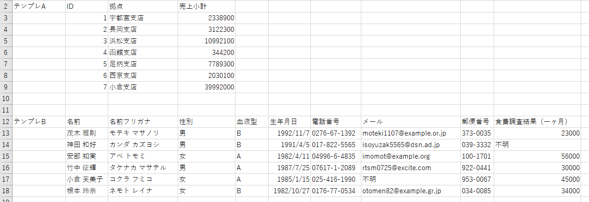
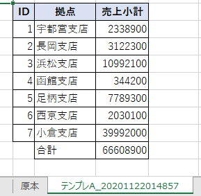

## この記事について

VBAにおけるクラスっていまいちマイナーで使いにくい存在だと思っている。  
理由はいくつかあって、  
- Javaなどと違ってクラスを使わなければ何も書けないという言語ではなく、  
書こうと思えばクラスを使わなくても手続き型で全て書けてしまう
- クラスの持つ機能が後発の言語に比べて弱いので（後述）、あえて使うメリットが見出しにくい。
- モジュールにPublicとして書けば何もせずとも呼び出せる関数でも、クラスの関数の場合はクラスのインスタンスを生成してからでないと利用できない。

ただ、  
クラスを利用したほうがずっと安全で、保守性も高く、バグも少なくコーディングできる場面ももちろん存在するため、  
この記事においてクラスを利用するメリットと方法についてを記したい。  
また、クラスを利用した簡単なサンプルも合わせて記載したい。

[<span id="srcURL"><u>説明のために作成したExcelファイルとソースコードはこちらでダウンロードできます。</u></span>](https://github.com/dede-20191130/My_VBA_Tools/tree/master/Public/2020/11/TableCreater)

## クラスを利用する方法

### クラスとは？

クラスとは、  
利用するデータ（変数・定数）と、そのクラスが持つ処理内容（関数）をひとつの箱（クラスモジュール）にまとめたもの。

といっても、無作為に適当な変数や関数を一緒にまとめれば良いというものではなく、  
そのクラスが指す一つの存在を定め、その存在に属するものとしての変数や関数でなければならない。

### クラスの例

例えば、  
ヒトという存在をクラスと定めれば、  
ヒトは目、口、胴体などのデータ（変数）と、  
走る、食べる、喋るなどの処理内容（関数）を持つ。

MSOffice風に言えば、  
ExcelのRangeオブジェクトは  
Addressプロパティ（参照範囲）やRowプロパティ（行の数値）、Valueプロパティ（セルの値）などの変数を持ち、  
Selectメソッド（範囲にカーソルを合わせる）や、  
AutoFitメソッド（範囲の行幅、列幅を自動調整する）などの関数を持つ、  
典型的なクラスのオブジェクトである。

また、ある一定の機能を持つモノという抽象的な概念もクラスとしてまとめ得る。  
例えば、ExcelのRangeオブジェクトを取込み、  
表のように、罫線を引き、  
ヘッダーの強調を行い、  
小計列の合計をセルに書き込むという一連の処理を担当するモノが挙げられる。  
これを、**TableCreater**と命名しよう。

|存在|変数・定数|関数|
|-|-|-|
|ヒト|目<br>口<br>胴体|走る<br>食べる<br>喋る|
|Excel<br>Rangeオブジェクト|Address<br>Row<br>Value|Select<br>AutoFit|
|TableCreater|対象のRangeオブジェクト<br>小計列の列番号<br>ヘッダーセルの色|罫線を引く<br>ヘッダーの強調のためのスタイル変更を行う<br>小計から合計を計算し出力する|

### クラスを利用するメリット

#### 安全なコーディングができる

クラスに宣言する変数、定数は  
基本的にはPrivateの適用範囲（スコープ）で宣言し、  
クラス内部の関数から用いるため、  
不用意な呼出しで値が影響を受けることを防ぐことができる（そもそも呼出しをするとコンパイルエラーになる）

また、外部から変数の値などを参照したい場合や変数の値を設定したい場合は、  
それ専用の関数として、  
Porperty Getステートメント、Porperty Let（変数の型がオブジェクトの場合はSet）ステートメントを用いた関数を実装し、  
それを通して外部とやりとりを行うようにすればよい。  
これを**カプセル化**という。

例えば、次のようなパーセント格納変数とPorperty Let関数は、  
パーセンテージとして0~100の値のみ許容し、それ以外の場合はNullを代入する。  
このように、値の取得や設定の際になんらかのフィルタやチェックを行い、安全性を高めることができる。  

```vb
Private percentVal As Variant

'**************************
'*Setter
'**************************
Public Property Let percent(ByVal v As Long)
    If v < 0 Or 100 < v Then percentVal = Null: Exit Property
    percentVal = v
End Property

```

#### 保守性の高いコーディングができる

クラスの関数が、引数や内部で宣言した変数や定数などのみを極力使用するように  
設計しておけば、  
他のクラスやモジュールとの結合性を低くすることができる（**疎結合**）。  


そうすれば、関数の処理変更や新しい関数の追加などでの影響範囲の大部分を  
クラス内に留めることができるため、  
思わぬ影響で想定外の動作をするリスクを低減することができる。

また、あるクラスにはそのクラスの指す対象に関係したコードしか書かれないようにしておけば、コードの見通しが大きく改善し、誰が見ても分かりやすいコードが書けるようになる。

#### 決まりきった処理を必ず実行するようにでき、コーディングのミスが減る

VBAのクラスには、クラスのオブジェクト生成・破棄時に必ず実行される関数がある。  
生成時は初期化処理であるClass_Initialize()、  
破棄時は終了処理であるClass_Terminate()が実行される。

クラス内部でOutlookのMailアイテムやAccessのRecordSetなどを扱う場合、  
外部の関数でこのクラスのオブジェクトを生成した際や破棄した際に必ず行うべき決まりきった処理をClass_InitializeやClass_Terminateに記載しておけば、  
コードを書く際にその処理を忘れたり間違った処理を書いたりすることを防ぐことができる。

例えば、
- OutlookのMailアイテムを扱うクラスの場合は、  
クラスのオブジェクトの生成時にOutlookアプリケーションも同時に生成したいし、  
クラスのオブジェクトの破棄時に新規作成あるいは編集したMailアイテムをDisplayメソッドにより見える状態にしたい。  
もし可視化を忘れてしまうと、バックグラウンドで生成されたメールにユーザはおそらく気づかない。<br><br>
- AccessのRecordSetを扱うクラスの場合は、
クラスのオブジェクトの生成時にAccessデータベースとのコネクションを設定する処理を実行したい。  
また、クラスのオブジェクトの破棄時にRecordSetをCloseし、それ以上の接続が必要なければデータベースとの接続もCloseしても良いかもしれない（「そのデータで何をしたいか」に依存するけれども、一例として）。  
もしCloseを忘れてしまうと、ずっとそのデータベースにつなぎ続けることになり、不本意な結果を生むかもしれない。


### ※VBAのクラスの持つ機能は、後発の言語に比べて弱い※

ただし、VBAのクラスにも弱点がある。  
VBAのクラス機能には残念ながら後発の言語に比べて癖があり、機能面でも後塵を拝する面が多少ある。

- Class_Initializeは引数を持つことができない。  
そのため、生成時に同時にクラス変数に値を代入したりすることができない。
- クラスの継承という概念が無い（継承については→→→ [[1]](https://murashun.jp/blog/20200113-63.html) [[2]](https://murashun.jp/blog/20200410-54.html)）
- staticな変数や関数を持つことができない。  
すなわち、クラスに記述した変数や関数は、すべて、一度クラスをオブジェクト化しないと利用できない。

これらのような不便さがあるのが弱点だと思う。



    VBAって今後もメンテされたり機能拡張されたりするんでしょうかね？ <br> 
    Microsoftは、より機能の高いPythonやJavascriptをもって、  <br>
    Officeの搭載言語をVBから入れ替えるみたいな話も小耳に挟んだので  
    なんとも言えないですが。。。<br><br>ともあれ、VBAはオブジェクト指向を理解する入り口としては優れたツールかと思っています。



### VBAにおけるクラスの利用方法の一例

#### i. VBEにおいてクラスモジュールを作成する

上記のTableCreaterの作成を例にしたいと思う。

VBE(VBAの開発画面)において  
挿入タブからクラスモジュールを選択し、  
作成する。

```vb
Option Explicit

'**************************
'*TableCreater
'**************************

```

#### ii. 変数・定数を宣言する

変数として、  
対象のRangeオブジェクト<br>小計列の列番号<br>ヘッダーセルの色  
を宣言する。

同時にProperty Let関数とProperty Set関数を記述する。

```vb
Option Explicit

'**************************
'*TableCreater
'**************************


'定数
Private Const HEADER_COLOR = 15917529 'ヘッダーセルの色

'変数
Private myRange As Range '範囲
Private myColumnSubTotal As Long '小計列番号


'******************************************************************************************
'*getter/setter
'******************************************************************************************


Public Property Set Range(ByVal pRng As Range)
    Set myRange = pRng
End Property


Public Property Let ColumnSubTotal(ByVal num As Long)
    '範囲変数が設定されていない状態で呼出は禁止
    If myRange Is Nothing Then Err.Raise 1000, , "範囲が設定されていません。"
    '引数が範囲オブジェクトの列番号より外の列の番号であればエラー
    If num < myRange.EntireColumn(1).Column Or myRange.EntireColumn(myRange.EntireColumn.Count).Column < num Then Err.Raise 1001, , "列番号の指定が不正です。"
    '値を設定
    myColumnSubTotal = num
End Property


```

#### iii. Class_Initialize、Class_Terminateを記述する

通常はここで初期化処理・終了処理のClass_Initialize、Class_Terminateを記述する。

ただ、TableCreaterクラスでは特にやることはない。

```vb
Option Explicit

'**************************
'*TableCreater
'**************************


'～～略～～

'******************************************************************************************
'*関数名    ：Class_Initialize
'*機能      ：
'*引数      ：
'******************************************************************************************
Private Sub Class_Initialize()
    
    '定数
    Const FUNC_NAME As String = "Class_Initialize"
    
    '変数
    
    On Error GoTo ErrorHandler
    
    '本クラスでは特にやることはない。

ExitHandler:

    Exit Sub
    
ErrorHandler:

    MsgBox "エラーが発生したため、マクロを終了します。" & _
           vbLf & _
           "関数名：" & FUNC_NAME & _
           vbLf & _
           "エラー番号：" & Err.Number & vbNewLine & _
           Err.Description, vbCritical, "TableCreater"
        
    GoTo ExitHandler
        
End Sub
```


#### iv. 関数を記述する

クラスが持つべきそれぞれの処理内容を一つずつの関数として記述する。

TableCreaterの持つべきクラスとしては以下のようになる
- 罫線を引く
- ヘッダーの強調のためのスタイル変更を行う
- 小計から合計を計算し出力する

```vb
Option Explicit

'**************************
'*TableCreater
'**************************


'～～略～～


'******************************************************************************************
'*関数名    ：drawLines
'*機能      ：罫線を引く
'*引数      ：
'*戻り値    ：True > 正常終了、False > 異常終了
'******************************************************************************************
Public Function drawLines() As Boolean
    
    '定数
    Const FUNC_NAME As String = "drawLines"
    
    '変数
    
    On Error GoTo ErrorHandler

    drawLines = False
    
    '範囲変数が設定されていない状態で呼出は禁止
    If myRange Is Nothing Then Err.Raise 1000, , "範囲が設定されていません。"
    
    '罫線を引く
    myRange.Borders.LineStyle = xlContinuous

    drawLines = True
    
ExitHandler:

    Exit Function
    
ErrorHandler:

    MsgBox "エラーが発生したため、マクロを終了します。" & _
           vbLf & _
           "関数名：" & FUNC_NAME & _
           vbLf & _
           "エラー番号：" & Err.Number & vbNewLine & _
           Err.Description, vbCritical, "TableCreater"
        
    GoTo ExitHandler
        
End Function


'******************************************************************************************
'*関数名    ：setStyleForHeader
'*機能      ：ヘッダーの強調のためのスタイル変更を行う
'               ヘッダーは与えられた範囲の一行目のセルとする
'*引数      ：
'*戻り値    ：True > 正常終了、False > 異常終了
'******************************************************************************************
Public Function setStyleForHeader() As Boolean
    
    '定数
    Const FUNC_NAME As String = "setStyleForHeader"
    
    '変数
    
    On Error GoTo ErrorHandler

    setStyleForHeader = False
    
    '範囲変数が設定されていない状態で呼出は禁止
    If myRange Is Nothing Then Err.Raise 1000, , "範囲が設定されていません。"
    
    'スタイル変更
    With myRange.Rows(1)
        '範囲の一行目のセルの色を変更
        .Interior.color = HEADER_COLOR
        '範囲の一行目を太字にする
        .Font.Bold = True
        '範囲の一行目を中央揃えにする
        .HorizontalAlignment = xlCenter
    End With
        
    
    setStyleForHeader = True
    
    
ExitHandler:

    Exit Function
    
ErrorHandler:

    MsgBox "エラーが発生したため、マクロを終了します。" & _
           vbLf & _
           "関数名：" & FUNC_NAME & _
           vbLf & _
           "エラー番号：" & Err.Number & vbNewLine & _
           Err.Description, vbCritical, "TableCreater"
        
    GoTo ExitHandler
        
End Function


'******************************************************************************************
'*関数名    ：calcTotalFromSubTotal
'*機能      ：小計列から合計を計算し出力する
'*引数      ：
'*戻り値    ：True > 正常終了、False > 異常終了
'******************************************************************************************
Public Function calcTotalFromSubTotal() As Boolean
    
    '定数
    Const FUNC_NAME As String = "calcTotalFromSubTotal"
    
    '変数
    Dim sumVal As Long
    Dim cell As Range
    Dim subTotalOrder As Long
    
    On Error GoTo ErrorHandler

    calcTotalFromSubTotal = False
    
    '範囲変数が設定されていない状態で呼出は禁止
    If myRange Is Nothing Then Err.Raise 1000, , "範囲が設定されていません。"
    '小計列が設定されていない状態で呼出は禁止
    If myColumnSubTotal = 0 Then Err.Raise 1002, , "小計列が設定されていません。"
        
    '小計列が範囲の列の何番目であるかを算出
    subTotalOrder = myColumnSubTotal - myRange(1).Column + 1
        
    '合計値計算（ヘッダー列は含まない）
    For Each cell In myRange.Columns(subTotalOrder).Cells.Offset(1).Resize(myRange.Columns(subTotalOrder).Cells.Offset(1).Cells.Count - 1)
        '数値の場合のみ加算
        If IsNumeric(cell.Value) Then sumVal = sumVal + cell.Value
    Next cell
    If sumVal = 0 Then GoTo TruePoint
    
    '合計値を小計列の最下端セルの下のセルに記入
    With myRange.Columns(subTotalOrder).Rows(myRange.Columns(subTotalOrder).Cells.Count).Offset(1)
        .Value = sumVal
        '合計ラベルセル
        With .Offset(, -1)
            'ラベルを記入
            .Value = "合計"
            '合計ラベルセルと合計セルに罫線を引く
            .Resize(, .Columns.Count + 1).Borders.LineStyle = xlContinuous
        End With
        
    End With
       
TruePoint:
       
    calcTotalFromSubTotal = True
    
ExitHandler:

    Exit Function
    
ErrorHandler:

    MsgBox "エラーが発生したため、マクロを終了します。" & _
           vbLf & _
           "関数名：" & FUNC_NAME & _
           vbLf & _
           "エラー番号：" & Err.Number & vbNewLine & _
           Err.Description, vbCritical, "TableCreater"
        
    GoTo ExitHandler
        
End Function

```


ここまででクラスのコーディングは完了。  
データ、動作を併せ持つ「テーブルを作成するモノ」の雛形であるクラスができた。


#### v. 外部の関数からクラスを利用する。

このように２種類のテンプレの表データが記載されている「原本」シートが  
ある。



それぞれのテンプレデータをもとに、  
新しいシートに表を作成するプログラムを作成した。  
この関数はTableCreaterを用いてなるべくシンプルに記述している。

```vb
'******************************************************************************************
'*関数名    ：TestTemplateA
'*機能      ：原本のテンプレAについて、TableCreaterを用いて表を作成する
'               作成場所：新規シート
'*引数      ：
'******************************************************************************************
Public Sub TestTemplateA()
    
    '定数
    Const FUNC_NAME As String = "TestTemplateA"
    
    '変数
    Dim ws As Worksheet
    Dim objTableCreater As tableCreater
    
    On Error GoTo ErrorHandler
    
    With ThisWorkbook
        '新規シート作成
        Set ws = .Worksheets.Add(, .Worksheets(.Worksheets.Count))
        ws.Name = "テンプレA_" & Format(Now, "yyyymmddhhnnss")
        
        '原本よりテンプレをコピー
        ws.Range(ws.Cells(2, 2), ws.Cells(9, 4)).Value = .Worksheets("原本").Range(.Worksheets("原本").Cells(2, 2), .Worksheets("原本").Cells(9, 4)).Value
        
        'TableCreaterをオブジェクト化
        Set objTableCreater = New tableCreater
        '範囲と小計列を設定
        Set objTableCreater.Range = ws.Range(ws.Cells(2, 2), ws.Cells(9, 4))
        objTableCreater.ColumnSubTotal = 4
        
        '罫線を引く 異常終了時はExitHandler（終了処理）に移行
        If Not objTableCreater.drawLines Then GoTo ExitHandler
         
        'ヘッダーの強調のためのスタイル変更を行う 異常終了時はExitHandler（終了処理）に移行
        If Not objTableCreater.setStyleForHeader Then GoTo ExitHandler
        
        '小計から合計を計算 異常終了時はExitHandler（終了処理）に移行
        If Not objTableCreater.calcTotalFromSubTotal Then GoTo ExitHandler
        
        '列幅の調整
        ws.Range(ws.Cells(2, 2), ws.Cells(9, 4)).EntireColumn.AutoFit
        
    End With
    

ExitHandler:
    
    '変数を解放
    Set objTableCreater = Nothing
    Set ws = Nothing
    
    Exit Sub
    
ErrorHandler:

    MsgBox "エラーが発生したため、マクロを終了します。" & _
           vbLf & _
           "関数名：" & FUNC_NAME & _
           vbLf & _
           "エラー番号：" & Err.Number & vbNewLine & _
           Err.Description, vbCritical, "TableCreater"
        
    GoTo ExitHandler
        
End Sub
```

これを実行すると、このようになる。  



#### vi. クラスの利用により得られたもの

TableCreaterを用いることで、  
ある程度は見通しの良いコードになっているかと思う。  

objTableCreater.で呼び出されるテキストを含むセンテンスは、  
テーブル作成関連の意味を持つとわかる。

また、TableCreaterの関数は引数を必要とせず、  
クラス内部の変数の利用で完結しているため、  
コードを見たときにどんな動作をしているかが把握しやすいと思う。  


## 終わりに

### TableCreaterサンプルとソースコードについて
<a href="#srcURL">こちらのリンク</a>をご参照ください。

### 記事の続き

TableCreaterの例だと、カプセル化の恩恵や初期化処理・終了処理を必ず実行できることの恩恵が十分には表現できなかったように思える。

後日、「クラスを利用するメリットと方法について & 簡単なサンプル（２）」という題で  
また別のケースのクラスの利用を記事にしたい。