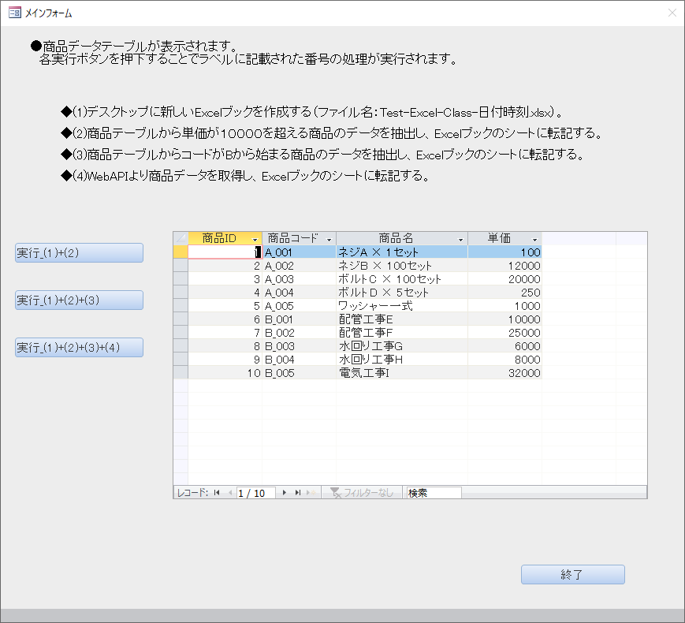
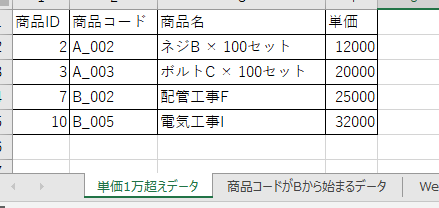
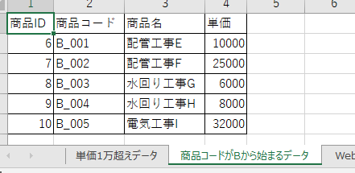
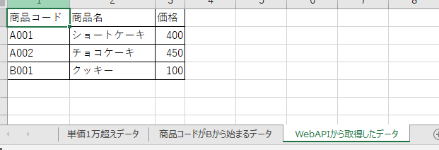

## この記事について

この記事は、  
[[VBA] クラスを利用するメリットと方法について & 簡単なサンプル（１）](../../20/excel-class-sample-01)の続きの記事。  
（１）とは違ったサンプルを用いて、前回とは違ったクラスの利用方法やそのメリットを記したい。

TableCreaterの例だと、カプセル化の恩恵や初期化処理・終了処理を必ず実行できることの恩恵が十分には表現できなかったように思えるため、  
本記事のサンプル（clsCreateNewExcel）でそれらを表現しようと思う。

[<span id="srcURL"><u>説明のために作成したAccessファイルとソースコードはこちらでダウンロードできます。</u></span>](https://github.com/dede-20191130/My_VBA_Tools/tree/master/Public/2020/11/Excel-Class)

## 作成環境
Windows10  
MSOffice 2019

## サンプルの概要

Accessファイルで、内部に商品テーブルを持つ。

次のような画面から、  
ボタンにより異なった処理を呼び出し実行する。



いずれのボタンのイベントも、共通処理として、  
- デスクトップに新しいExcelブックを作成する（ファイル名：Test-Excel-Class-日付時刻.xlsx）

を持つ。

個別の処理として、
- 商品テーブルから単価が１００００を超える商品のデータを抽出し、<br>作成したExcelブックのシートに転記する。
- 商品テーブルからコードがBから始まる商品のデータを抽出し、<br>作成したExcelブックのシートに転記する。
- WebAPIより商品データのJsonデータを取得し、<br>テーブル形式にパースしたのち、Excelブックのシートに転記する。

を持つ。

Excelブック作成とブック関連オブジェクトの管理のために、  
clsCreateNewExcelクラスというクラスモジュールを作成した。

## clsCreateNewExcelクラス

### 役割

clsCreateNewExcelクラスは新規Excelアプリケーションのインタフェースと新規Excelブックを生成し、  
それぞれのオブジェクトを取得することを許す。  
また、呼び出されるたびにブックにワークシートを追加する関数を持つ。

### コード

```vb
'@Folder("class")
Option Compare Database
Option Explicit

'**************************
'*Excelブック作成クラス
'**************************

'定数
Private currentSheetNum As Long

'変数
Private myXlApp As Object
Private myWorkBook As Object
Private dicWorkSheet As Dictionary


'******************************************************************************************
'*getter/setter
'******************************************************************************************
Public Property Get xlApplication() As Object
    Set xlApplication = myXlApp
End Property


Public Property Get Workbook() As Object
    Set Workbook = myWorkBook
End Property


Public Property Get WorkSheets(ByVal num As Long) As Object
    If Not dicWorkSheet.Exists(num) Then Call MsgBox("シートがありません。", vbExclamation, TOOL_NAME): Set WorkSheets = Nothing: Exit Property
    Set WorkSheets = dicWorkSheet.Item(num)
End Property


'******************************************************************************************
'*関数名    ：Class_Initialize
'*機能      ：
'*引数      ：
'******************************************************************************************
Private Sub Class_Initialize()
    
    '定数
    Const FUNC_NAME As String = "Class_Initialize"
    
    '変数
    
    On Error GoTo ErrorHandler
    
    'シート数の設定
    currentSheetNum = 1
    
    'オブジェクトの設定
    Set myXlApp = CreateObject("Excel.Application")
    With myXlApp
        'バックグラウンドで生成・編集
        .Visible = False
        .ScreenUpdating = False
        .DisplayAlerts = False
    End With
    Set myWorkBook = myXlApp.Workbooks.Add
    Set dicWorkSheet = New Dictionary
    dicWorkSheet.Add currentSheetNum, myWorkBook.WorkSheets(currentSheetNum)
    
ExitHandler:

    Exit Sub
    
ErrorHandler:

    MsgBox "エラーが発生したため、マクロを終了します。" & _
           vbLf & _
           "関数名：" & FUNC_NAME & _
           vbLf & _
           "エラー番号：" & Err.Number & vbNewLine & _
           Err.Description, vbCritical, TOOL_NAME
        
    GoTo ExitHandler
        
End Sub


'******************************************************************************************
'*関数名    ：Class_Terminate
'*機能      ：
'*引数      ：
'******************************************************************************************
Private Sub Class_Terminate()
    
    '定数
    Const FUNC_NAME As String = "Class_Terminate"
    
    '変数
    
    On Error GoTo ErrorHandler
    
    'ブックの保存 To:=デスクトップ
    With CreateObject("WScript.Shell")
        myWorkBook.SaveAs .SpecialFolders("Desktop") & "\" & "Test-Excel-Class-" & Format(Now, "yyyymmddhhnnss") & ".xlsx"
    End With
    
    '設定のリストア
    With myXlApp
        .ScreenUpdating = True
        .DisplayAlerts = True
    End With
    
    'クローズ
    myWorkBook.Close
    myXlApp.Quit

ExitHandler:
    
    Set dicWorkSheet = Nothing
    Set myWorkBook = Nothing
    Set myXlApp = Nothing
    
    Exit Sub
    
ErrorHandler:

    MsgBox "エラーが発生したため、マクロを終了します。" & _
           vbLf & _
           "関数名：" & FUNC_NAME & _
           vbLf & _
           "エラー番号：" & Err.Number & vbNewLine & _
           Err.Description, vbCritical, TOOL_NAME
        
    GoTo ExitHandler
        
End Sub


'******************************************************************************************
'*関数名    ：addNewSheet
'*機能      ：ブックにシートを追加
'*引数      ：
'*戻り値    ：追加されたシートオブジェクト
'******************************************************************************************
Public Function addNewSheet() As Object
    
    '定数
    Const FUNC_NAME As String = "addNewSheet"
    
    '変数
    Dim ws As Object
    
    On Error GoTo ErrorHandler

    Set addNewSheet = Nothing
    
    currentSheetNum = currentSheetNum + 1
    '最後尾にシート追加
    Set ws = myWorkBook.WorkSheets.Add(After:=myWorkBook.WorkSheets(myWorkBook.WorkSheets.Count))
    dicWorkSheet.Add currentSheetNum, ws
    
    Set addNewSheet = ws
    
ExitHandler:

    Exit Function
    
ErrorHandler:

    MsgBox "エラーが発生したため、マクロを終了します。" & _
           vbLf & _
           "関数名：" & FUNC_NAME & _
           vbLf & _
           "エラー番号：" & Err.Number & vbNewLine & _
           Err.Description, vbCritical, TOOL_NAME
        
    GoTo ExitHandler
        
End Function


```

### カプセル化

上記のコードを見るとわかるように、  
クラス内部の変数myXlApp、myWorkBookなどはPrivateのスコープで宣言されている。  
そのため、  
各種Property Getを通してのみ取得可能であり、  
直接値を参照して取得したり設定したりすることはできない。  

唯一、dicWorkSheet（ワークシートが格納されているDictionaryオブジェクト）は、  
関数addNewSheetを通してのみDicitonaryのKey&Valueペアの設定が可能である。  
その動作すらも、「最後尾にシートを追加する」という定型的な動作以外は許されていない。

このように、クラス内部の変数が特定の方法以外で値の設定ができないように守られていることをカプセル化と呼ぶ。

カプセル化により、クラスの変数が不正に設定されたり削除されたりすることを防ぎ、バグの発生を防いだり、コードの見通しを良くしたりする。

### 初期化処理・終了処理

こちらも上記のコードを見るとわかるように、  
Class_Initializeにおいて、クラスのオブジェクトを生成した際に  
最低限やりたい処理をまとめて行うことができるようになっている。  

最低限やりたい処理とは、  
新規Excelアプリケーションのインタフェースの生成、  
新規Excelブックの生成、  
ブックの最初のワークシートをDictionaryに格納すること、  
Excelアプリケーションの動作をバックグラウンドにし、画面更新を停止し、警告アラートを抑制することである。

Class_Terminateは逆に、  
Excelアプリケーションの設定のリストアを行い、  
ブックをクローズし、Excelアプリケーションを終了させる。  
また、PCのデスクトップにブックを保存させる。

このように、最低限やりたい処理をかならず実行するようにできているため、  
わざわざ外部のコードで記述する必要もないし、  
見落としてコーディングし忘れたりする恐れもなくなる。

特に、Excelアプリケーションのオブジェクトの場合、  
オブジェクトを格納した変数がグローバル変数であり、かつ処理後にNothingが代入されなかった場合、  
ずっとExcelがバックグラウンドで起動し続けることになるため、注意が必要。  

## その他のコード

### getTableHeader

引数で指定したテーブルのヘッダー文字列配列を、  
値返却用の変数に格納して呼び出し元に返す。

```vb
'******************************************************************************************
'*関数名    ：getTableHeader
'*機能      ：テーブルのヘッダー文字列配列を取得
'*引数      ：テーブル名
'*引数      ：結果返却用
'*戻り値    ：True > 正常終了、False > 異常終了
'******************************************************************************************
Public Function getTableHeader(ByVal tblName As String, ByRef pArrHeader() As String) As Boolean
    
    '定数
    Const FUNC_NAME As String = "getTableHeader"
    
    '変数
    Dim i As Long
    
    On Error GoTo ErrorHandler

    getTableHeader = False
    Erase pArrHeader
    
    With db.TableDefs(tblName)
        ReDim pArrHeader(0 To .Fields.Count - 1)
        For i = 0 To .Fields.Count - 1
            pArrHeader(i) = .Fields(i).Name
        Next
    End With
    
    getTableHeader = True
    
ExitHandler:

    Exit Function
    
ErrorHandler:

    MsgBox "エラーが発生したため、マクロを終了します。" & _
           vbLf & _
           "関数名：" & FUNC_NAME & _
           vbLf & _
           "エラー番号：" & Err.Number & vbNewLine & _
           Err.Description, vbCritical, TOOL_NAME
        
    GoTo ExitHandler
        
End Function
```

### getTableDataBySQL

引数のSQL文字列をもとに得られたレコードセットのデータを二次元配列として取得し、  
値返却用の変数に格納して呼び出し元に返す。

```vb
'******************************************************************************************
'*関数名    ：getTableDataBySQL
'*機能      ：SQL文字列より得られたレコードセットのデータを二次元配列として取得
'*引数      ：対象SQL文字列
'*引数      ：結果返却用
'*戻り値    ：True > 正常終了、False > 異常終了
'******************************************************************************************
Public Function getTableDataBySQL(ByVal sql As String, ByRef arrData() As Variant) As Boolean
    
    '定数
    Const FUNC_NAME As String = "getTableDataBySQL"
    
    '変数
    Dim rs As DAO.Recordset
    Dim i As Long
    Dim j As Long
    
    On Error GoTo ErrorHandler

    getTableDataBySQL = False
    Erase arrData
    
    Set rs = db.OpenRecordset(sql)
    With rs
        If .EOF Then GoTo TruePoint
        .MoveLast
        ReDim arrData(0 To .RecordCount - 1, 0 To .Fields.Count - 1)
        .MoveFirst
        
        i = 0
        Do Until .EOF
            For j = 0 To .Fields.Count - 1
                arrData(i, j) = .Fields(j).Value
            Next j
            i = i + 1
            .MoveNext
        Loop
    End With

TruePoint:

    getTableDataBySQL = True
    
ExitHandler:
    
    If Not rs Is Nothing Then rs.Clone: Set rs = Nothing
    
    Exit Function
    
ErrorHandler:

    MsgBox "エラーが発生したため、マクロを終了します。" & _
           vbLf & _
           "関数名：" & FUNC_NAME & _
           vbLf & _
           "エラー番号：" & Err.Number & vbNewLine & _
           Err.Description, vbCritical, TOOL_NAME
        
    GoTo ExitHandler
        
End Function
```

### postDataToSheet

引数のシートオブジェクトの  
一行目に指定されたテーブルヘッダー文字列配列を、   
二行目以降にテーブルデータの二次元配列データを転記する。

```vb

'******************************************************************************************
'*関数名    ：postDataToSheet
'*機能      ：シートに配列データを転記する
'*引数      ：対象シート
'*引数      ：シート名
'*引数      ：ヘッダー配列
'*引数      ：データ配列
'*戻り値    ：True > 正常終了、False > 異常終了
'******************************************************************************************
Public Function postDataToSheet( _
    ByVal tgtSheet As Object, _
    ByVal sheetName As String, _
    ByVal pArrHeader As Variant, _
    ByVal pArrData As Variant _
) As Boolean
    
    '定数
    Const FUNC_NAME As String = "postDataToSheet"
    
    '変数
    
    On Error GoTo ErrorHandler

    postDataToSheet = False
    
    With tgtSheet
        .Name = sheetName
        .Range(.cells(1, 1), .cells(1, UBound(pArrHeader) - LBound(pArrHeader) + 1)).Value = pArrHeader
        .Range(.cells(2, 1), .cells(UBound(pArrData, 1) - LBound(pArrData, 1) + 2, UBound(pArrData, 2) - LBound(pArrData, 2) + 1)).Value = pArrData
        '罫線
        .Range(.cells(1, 1), .cells(UBound(pArrData, 1) - LBound(pArrData, 1) + 2, UBound(pArrData, 2) - LBound(pArrData, 2) + 1)).Borders.LineStyle = xlContinuous
        '列幅調整
        .Range(.Columns(1), .Columns(UBound(pArrHeader) - LBound(pArrHeader) + 1)).AutoFit
    End With

    postDataToSheet = True
    
ExitHandler:

    Exit Function
    
ErrorHandler:

    MsgBox "エラーが発生したため、マクロを終了します。" & _
           vbLf & _
           "関数名：" & FUNC_NAME & _
           vbLf & _
           "エラー番号：" & Err.Number & vbNewLine & _
           Err.Description, vbCritical, TOOL_NAME
        
    GoTo ExitHandler
        
End Function

```

### getJsonFromAPI

指定URLのWebAPIからJson文字列を取得する。  
本ツールではGoogle Apps Script(GAS)上のAPIを叩いて  
商品テーブルデータのもととなるJsonを取得する。

```vb

'******************************************************************************************
'*関数名    ：getJsonFromAPI
'*機能      ：指定URLのAPIからJson文字列を取得
'*引数      ：URL
'*戻り値    ：Json文字列（Parse前）
'******************************************************************************************
Public Function getJsonFromAPI(URL As String) As String

    '定数
    Const FUNC_NAME As String = "getJsonFromAPI"
    
    '変数
    Dim objXMLHttp As Object
    
    On Error GoTo ErrorHandler

    getJsonFromAPI = ""
    
    Set objXMLHttp = CreateObject("MSXML2.ServerXMLHTTP.6.0")
        objXMLHttp.Open "GET", URL, False
        objXMLHttp.Send


    getJsonFromAPI = objXMLHttp.responseText
    
ExitHandler:

    Exit Function
    
ErrorHandler:

    MsgBox "エラーが発生したため、マクロを終了します。" & _
           vbLf & _
           "関数名：" & FUNC_NAME & _
           vbLf & _
           "エラー番号：" & Err.Number & vbNewLine & _
           Err.Description, vbCritical, TOOL_NAME
        
    GoTo ExitHandler
        
End Function

```


## 実行すると

例えばフォームで一番下の「実行_(1)+(2)+(3)+(4)」ボタンを実行すると、  
次のようなExcelブックがデスクトップ上に生成される。








## サンプルとソースコードについて

<a href="#この記事について">こちら</a>をご参照ください。

## 終わりに

GASを用いると簡単にJSONを返すAPIが作れるみたいですね。  
知らなかったです。

[JSONを返す無料APIを3分で作る方法 - Qiita](https://qiita.com/ykhirao/items/a41322085ab55837b88e#google-apps-scriptgas%E3%82%92%E4%BD%BF%E3%81%86)


