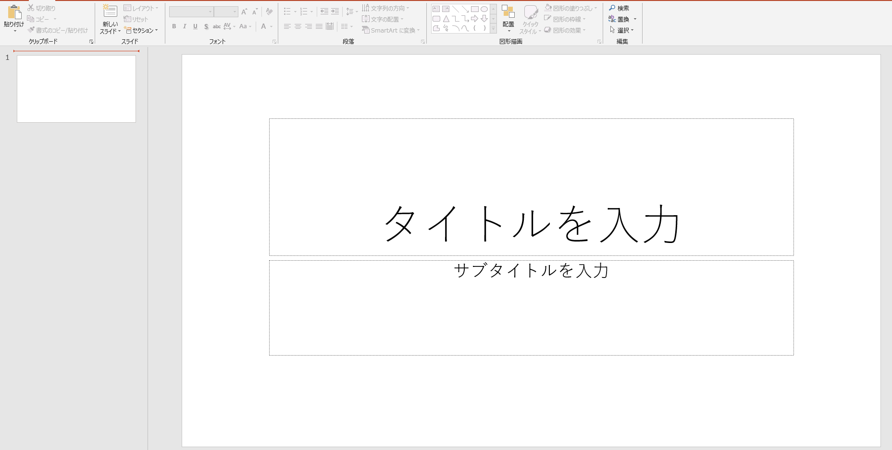
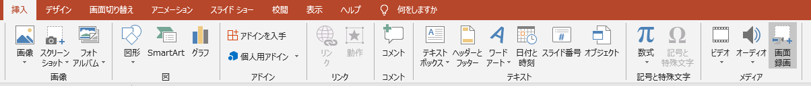
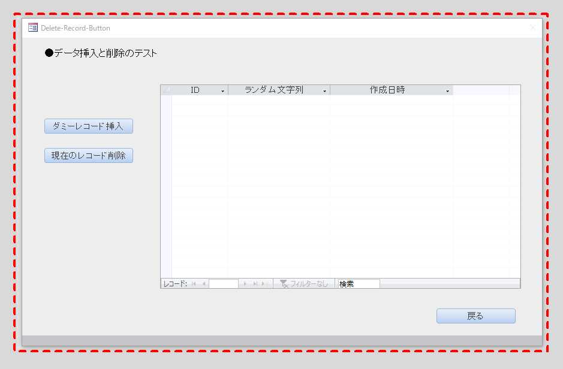
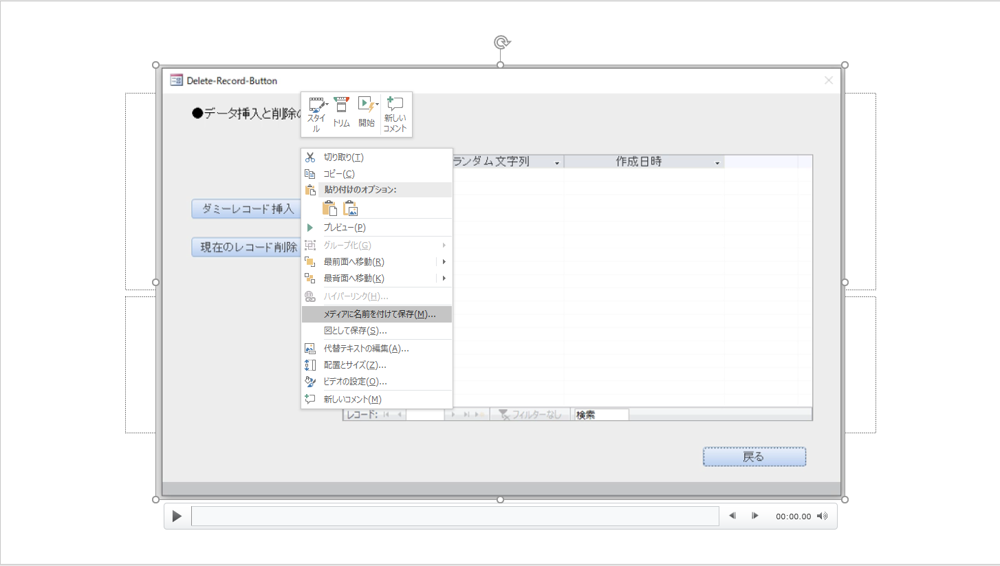

## この記事について

Windows10には録画機能（名称：ゲームバー。Winキー+Gで起動）があり、  
通常のアプリケーションであればこれで録画が可能である。

ところが、  
ExcelやAccessのフォームはなぜか画面判定されず、  
録画ができないことがわかった。

（ゲームバーで範囲指定による録画ができない。  
もしできるようになる設定があれば教えてほしいです。）

そのため、いろいろ模索していたが、  
PowerPointの録画機能でフォームを録画できたため、ここに記したい。

## 方法
### i. PowerPointを開く

### ii. 挿入タブ->画面録画を選択

### iii. 録画範囲を選択し、録画ボタンを押す

### iv. スライドショーに保存された動画を保存する

## サンプル

こちらで紹介しているファイルのgifは  
上の方法で作成された動画を元にしている。  
（mp4動画のgif化はffmpegを使用した）

[[Access VBA] フォームのコントロールに対してWithEventsでイベントリスナークラスを作成する際に気をつけなければならないこと](https://dede-20191130.github.io/learnerBlog/posts/2020/11/08/access-control-withevents/#%E3%83%88%E3%83%A9%E3%83%96%E3%83%AB)

