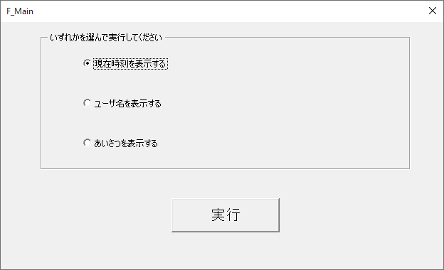
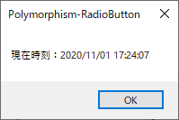
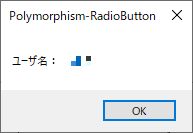
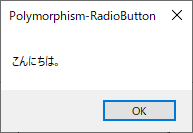

## この記事について

CallByName関数によるポリモーフィズムの考え方と、  
ラジオボタン（オプションボタン）オブジェクトのtagプロパティを用いて、  
IFステートメントやSelect Caseステートメントを使わずに処理分岐を行う実装例。


[説明のために作成したExcelファイルとソースコードはこちらでダウンロードできます。](https://github.com/dede-20191130/My_VBA_Tools/tree/master/Public/2020/11/Polymorphism-RadioButton)

## 作成環境
Windows10  
MSOffice 2016

## 前提

下のような画面があり、  
ラジオボタンを選択し、実行ボタンを押下することで  
ラジオボタンの種類に応じた処理を行う。

|名称|画像|
|--|--|
|**フォーム**||
|**現在時刻を表示するラジオボタンを選択**||
|**ユーザ名を表示するラジオボタンを選択**||
|**あいさつを表示するラジオボタンを選択**||

## オブジェクトのプロパティ


|名前|種類|Caption|GourpName|Tag|Value（初期値）|
|--|--|--|--|--|--|
|rdo_showCurrent|ラジオボタン|現在時刻を表示する|Group01|Current|True|
|rdo_showUser|ラジオボタン|ユーザ名を表示する|Group01|User|False|
|rdo_showGreeting|ラジオボタン|あいさつを表示する|Group01|Greeting|False|
|btn_execute|コマンドボタン|実行|--|--|--|

## 関数概要

|名前|所属モジュール/クラス|種類|機能|
| ---- | ---- | ---- | ---- |
|btn_execute_Click| F_Main |Subプロシージャ|btn_executeのClickメソッド<br>ラジオボタンの種類に応じた処理を実行する|
|btn_execute_Click_Current| clsPolymo |Functionプロシージャ|現在時刻を表示する|
|btn_execute_Click_User| clsPolymo |Functionプロシージャ|ユーザ名を表示する|
|btn_execute_Click_Greeting| clsPolymo |Functionプロシージャ|あいさつを表示する|

## コード

### [btn_execute_Click]
```vb
'******************************************************************************************
'*関数名    ：btn_execute_Click
'*機能      ：
'*引数(1)   ：
'******************************************************************************************
Private Sub btn_execute_Click()
    
    '定数
    Const FUNC_NAME As String = "btn_execute_Click"
    
    '変数
    Dim suffix As String
    Dim objPolymo As clsPolymo
    
    On Error GoTo ErrorHandler
    
    Set objPolymo = New clsPolymo
    
    '選択された処理を取得
    '再帰的なファイル検索の有無
    suffix = _
           WorksheetFunction.Rept(Me.rdo_showCurrent.Tag, Abs(CLng(CBool(Me.rdo_showCurrent.Value)))) & _
           WorksheetFunction.Rept(Me.rdo_showUser.Tag, Abs(CLng(CBool(Me.rdo_showUser.Value)))) & _
           WorksheetFunction.Rept(Me.rdo_showGreeting.Tag, Abs(CLng(CBool(Me.rdo_showGreeting.Value))))
    If suffix = "" Then MsgBox "ラジオボタンの選択が不正です", vbCritical, Tool_Name: GoTo ExitHandler
    
    '処理関数の呼出
    If Not CallByName(objPolymo, FUNC_NAME & "_" & suffix, VbMethod) Then GoTo ExitHandler
    

ExitHandler:
    
    Set objPolymo = Nothing
    
    Exit Sub
    
ErrorHandler:

    MsgBox "エラーが発生したため、マクロを終了します。" & _
           vbLf & _
           "関数名：" & FUNC_NAME & _
           vbLf & _
           "エラー番号：" & Err.Number & vbNewLine & _
           Err.Description, vbCritical, Tool_Name
        
    GoTo ExitHandler
        
End Sub
```


WorksheetFunction.Rept関数は  
①引数の文字列を②引数の数だけ繰り返た文字列を返す。
```vb
'abcabcabc
WorksheetFunction.Rept("abc",3)
```

Abs(CLng(CBool(Me.rdo_showCurrent.Value)))は、  
ラジオボタンが選択された状態であれば、**1**を、  
非選択の状態であれば、**0**を返す。

よって、  
suffix変数には、選択されたラジオボタンのみのTagプロパティの文字列が  
代入される。  

CallByName関数によって、  
clsPolymoクラスに用意されている、  
btn_execute_Click＋〇〇（Tagの文字）の関数が呼び出される。

### [btn_execute_Click_Current]

```vb
'******************************************************************************************
'*関数名    ：btn_execute_Click_Current
'*機能      ：現在時刻を表示する
'*引数(1)   ：
'*戻り値    ：True > 正常終了、False > 異常終了
'******************************************************************************************
Public Function btn_execute_Click_Current() As Boolean
    
    '定数
    Const FUNC_NAME As String = "btn_execute_Click_Current"
    
    '変数
    
    On Error GoTo ErrorHandler

    btn_execute_Click_Current = False
    
    '現在時刻を表示する
    MsgBox "現在時刻：" & Now, , Tool_Name

    btn_execute_Click_Current = True
    
ExitHandler:

    Exit Function
    
ErrorHandler:

    MsgBox "エラーが発生したため、マクロを終了します。" & _
           vbLf & _
           "関数名：" & FUNC_NAME & _
           vbLf & _
           "エラー番号：" & Err.Number & vbNewLine & _
           Err.Description, vbCritical, Tool_Name
        
    GoTo ExitHandler
        
End Function
```

### [btn_execute_Click_User]

```vb
'******************************************************************************************
'*関数名    ：btn_execute_Click_User
'*機能      ：ユーザ名を表示する
'*引数(1)   ：
'*戻り値    ：True > 正常終了、False > 異常終了
'******************************************************************************************
Public Function btn_execute_Click_User() As Boolean
    
    '定数
    Const FUNC_NAME As String = "btn_execute_Click_User"
    
    '変数
    
    On Error GoTo ErrorHandler

    btn_execute_Click_User = False
    
    With CreateObject("WScript.Network")
        'ユーザ名を表示する
        MsgBox "ユーザ名：" & .UserName, , Tool_Name
    End With

    btn_execute_Click_User = True
    
ExitHandler:

    Exit Function
    
ErrorHandler:

    MsgBox "エラーが発生したため、マクロを終了します。" & _
           vbLf & _
           "関数名：" & FUNC_NAME & _
           vbLf & _
           "エラー番号：" & Err.Number & vbNewLine & _
           Err.Description, vbCritical, Tool_Name
        
    GoTo ExitHandler
        
End Function

```

### [btn_execute_Click_Greeting]

```vb
'******************************************************************************************
'*関数名    ：btn_execute_Click_Greeting
'*機能      ：あいさつを表示する
'*引数(1)   ：
'*戻り値    ：True > 正常終了、False > 異常終了
'******************************************************************************************
Public Function btn_execute_Click_Greeting() As Boolean
    
    '定数
    Const FUNC_NAME As String = "btn_execute_Click_Greeting"
    
    '変数
    
    On Error GoTo ErrorHandler

    btn_execute_Click_Greeting = False
    
    MsgBox "こんにちは。", , Tool_Name
    
    btn_execute_Click_Greeting = True
    
ExitHandler:

    Exit Function
    
ErrorHandler:

    MsgBox "エラーが発生したため、マクロを終了します。" & _
           vbLf & _
           "関数名：" & FUNC_NAME & _
           vbLf & _
           "エラー番号：" & Err.Number & vbNewLine & _
           Err.Description, vbCritical, Tool_Name
        
    GoTo ExitHandler
        
End Function
```

ポリモーフィズムによって、  
clsPolymoから呼び出される関数が  
suffixの値に従って決定されるため、  
IFステートメントの使用無しで処理分岐を実行できる。

## この仕組みを使用したツール

↓↓こちらの記事で紹介しました。  ↓↓
[[Excel VBA]選択フォルダ配下のエクセルブックの全シートでA1にカーソル移動させるツールを作成した](../excel-a1-tool/)