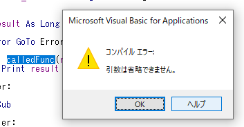
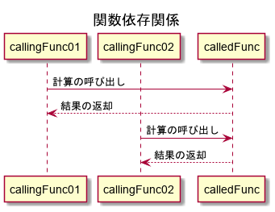
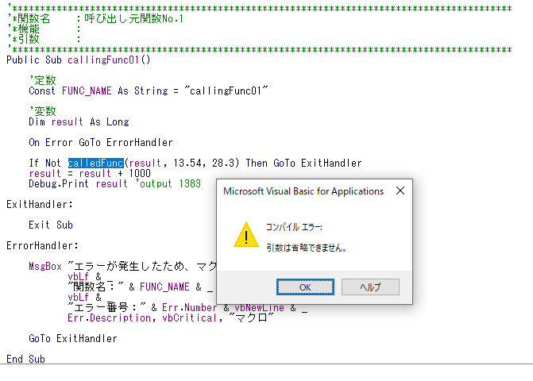
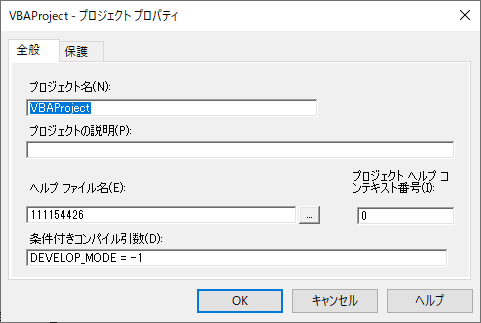
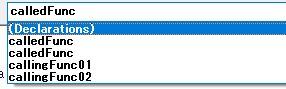

## この記事について

プログラミングにおいて、  
コードの保守性（他人や未来の自分から見て理解のしやすさ・変更の容易さ）を向上させるため、  
外部から見た時の挙動は変えずに、プログラムの内部構造を変更するという作業が発生する場合がある。

これをリファクタリングと呼ぶ。

リファクタリングの際、関数の引数の数を減らしたり増やしたりすることがあるかもしれない。  
すると、VBE（VBAのエディタ）でコンパイルが行われる際に、  
その関数の使用箇所全てでコンパイルエラーが起こる可能性がある。



これを防ぐために、  
コンパイルエラーを一時抑制するテクニックを使用すると便利。  

そのテクニックについて記したい。

[<span id="srcURL"><u>説明のために作成したExcelファイルとソースコードはこちらでダウンロードできます。</u></span>](https://github.com/dede-20191130/My_VBA_Tools/tree/master/Public/2020/12/Alter-Args-Compile-Err)

## 作成環境

Windows 10 Home(64bit)  
MSOffice 2016

## 事例

### 前提

次のように、  
一つの関数が複数の関数によって  
呼び出されている場合を考える。



ここではcallingFunc01、02のみがcalledFuncを呼び出しているが、  
たいていのVBAツールやVBAアプリケーションでは  
一つの役割を持つ関数は3つ以上の多数の関数に呼び出しをされることもあるだろう。


### コード

#### callingFunc01

```vb
'******************************************************************************************
'*関数名    ：呼び出し元関数No.1
'*機能      ：
'*引数      ：
'******************************************************************************************
Public Sub callingFunc01()
    
    '定数
    Const FUNC_NAME As String = "callingFunc01"
    
    '変数
    Dim result As Long
    
    On Error GoTo ErrorHandler

    If Not calledFunc(result, 13.54, 28.3) Then GoTo ExitHandler
    result = result + 1000
    Debug.Print result 'output 1383
    
ExitHandler:

    Exit Sub
    
ErrorHandler:

    MsgBox "エラーが発生したため、マクロを終了します。" & _
           vbLf & _
           "関数名：" & FUNC_NAME & _
           vbLf & _
           "エラー番号：" & Err.Number & vbNewLine & _
           Err.Description, vbCritical, "マクロ"
        
    GoTo ExitHandler
        
End Sub
```

#### callingFunc02

```vb
'******************************************************************************************
'*関数名    ：呼び出し元関数No.2
'*機能      ：
'*引数      ：
'******************************************************************************************
Public Sub callingFunc02()
    
    '定数
    Const FUNC_NAME As String = "callingFunc02"
    
    '変数
    Dim result As Long
    
    On Error GoTo ErrorHandler

    If Not calledFunc(result, 12.5, 33.33) Then GoTo ExitHandler
    result = result + 5000
    Debug.Print result 'output 5416
    
ExitHandler:

    Exit Sub
    
ErrorHandler:

    MsgBox "エラーが発生したため、マクロを終了します。" & _
           vbLf & _
           "関数名：" & FUNC_NAME & _
           vbLf & _
           "エラー番号：" & Err.Number & vbNewLine & _
           Err.Description, vbCritical, "マクロ"
        
    GoTo ExitHandler
        
End Sub

```

#### calledFunc

```vb
'******************************************************************************************
'*関数名    ：呼び出される関数
'*機能      ：引数の２数の乗算を行い、小数点を切り捨てし整数として返す
'*引数      ：参照渡しで結果を返却する変数
'*引数      ：乗算される数値１
'*引数      ：乗算される数値２
'*戻り値    ：True > 正常終了、False > 異常終了
'******************************************************************************************
Public Function calledFunc(ByRef returnNum As Long, ByVal num01 As Double, ByVal num02 As Double) As Boolean
    
    '定数
    Const FUNC_NAME As String = "calledFunc"
    
    '変数
    
    On Error GoTo ErrorHandler

    calledFunc = False
    
    returnNum = Int(num01 * num02)


TruePoint:

    calledFunc = True

ExitHandler:

    Exit Function
    
ErrorHandler:

    MsgBox "エラーが発生したため、マクロを終了します。" & _
           vbLf & _
           "関数名：" & FUNC_NAME & _
           vbLf & _
           "エラー番号：" & Err.Number & vbNewLine & _
           Err.Description, vbCritical, "マクロ"
        
    GoTo ExitHandler
        
End Function

```

### リファクタリングで引数を増やすと起こること

例えば、  
`result = result + 1000`  
ここの加算の部分も  
呼び出し元ではなくcalledFunc側で処理するようにリファクタリングしたい場合があるとする。

すると、calledFuncの引数を増やさなければいけない。

```vb
'******************************************************************************************
'*関数名    ：呼び出される関数
'*機能      ：引数の２数の乗算を行い、小数点を切り捨てし整数を得る。
'*　　　　　　得た整数に整数を加算し、返す
'*引数      ：参照渡しで結果を返却する変数
'*引数      ：乗算される数値１
'*引数      ：乗算される数値２
'*引数      ：加算される整数値
'*戻り値    ：True > 正常終了、False > 異常終了
'******************************************************************************************
Public Function calledFunc(ByRef returnNum As Long, ByVal num01 As Double, ByVal num02 As Double, ByVal addNum As Long) As Boolean
    
    '定数
    Const FUNC_NAME As String = "calledFunc"
    
    '変数
    
    On Error GoTo ErrorHandler

    calledFunc = False
    
    returnNum = Int(num01 * num02)
    returnNum = returnNum + addNum


TruePoint:

    calledFunc = True

ExitHandler:

    Exit Function
    
ErrorHandler:

    MsgBox "エラーが発生したため、マクロを終了します。" & _
           vbLf & _
           "関数名：" & FUNC_NAME & _
           vbLf & _
           "エラー番号：" & Err.Number & vbNewLine & _
           Err.Description, vbCritical, "マクロ"
        
    GoTo ExitHandler
        
End Function

```

このままコンパイルを実行する（もしくは自動でコンパイルが実行される）と、  
それぞれの呼び出し元で、  
コンパイル時にエラーが発生する。




    厄介なのが、<br>
    このエラーを解消するためには  <br>
    すべての呼び出し元の関数のcalledFunc呼び出し箇所で、  <br>
    追加の引数を設定しなければならないこと。


上の事例のようなシンプルな関数ならば  
影響範囲も狭く、特に変更に時間はかからない。

しかし、より複雑な関数や引数となると、  
すべての変更箇所を対応しないことには、  
コンパイルエラーが解消できず、  
動作検証もできなくなってしまう。

### Optionalキーワードの使用は？

エラーを起こらなくさせるために、  
一時的にOptional（省略可能引数）キーワードを使うという方法がある。

```vb
Public Function calledFunc(ByRef returnNum As Long, ByVal num01 As Double, _
    ByVal num02 As Double, Optional ByVal addNum As Long = 0) As Boolean
```

`Optional ByVal addNum As Long = 0`　とすることによって、  
エラーは解消され、  
設定されていない呼び出し元においては全て0である数値をaddNum引数とするとみなされて  
処理が行われる。

しかし、この場合怖いのは戻し忘れである。

コンパイルが通ってしまうばっかりに、  
せっかくリファクタリングするつもりの呼び出し部分で引数の追加を忘れたり、  
加算したつもりがされていなかったりするヒューマンエラーを招きかねない。  

そのため、  
一時的にコンパイルエラーを抑制し、  
なおかつ変更の反映のできていない部分では最終的にチェックできるようなテクニックが望まれる。

## テクニック

### 条件付きコンパイル引数

VBAプロジェクトには、  
条件付きコンパイル引数という設定項目がある。

[こちらのサイト様に詳細な説明があります。<br>条件付きコンパイル ー VBAでコードを選択的に実行する（LINK）](https://screwandsilver.com/conditional_compilation/)

  
<br>


<br>

上記のように、  
プロジェクトのプロパティの画面で  
条件付きコンパイル引数を設定することができる。  

これにより、  
開発時の環境、動作検証時の環境、本番時の環境などを  
分けることができる。

今回は、`DEVELOP_MODE`という引数を設定し、  
値を-1とする（本当はTrueとしたいが、条件付きコンパイル引数はBoolean値を受け付けないため）。



### コードの変更

次のように、  
条件付きコンパイルのIF構文を用いて、  
環境ごとに関数の宣言を分ける。

```vb
'******************************************************************************************
'*関数名    ：呼び出される関数
'*機能      ：引数の２数の乗算を行い、小数点を切り捨てし整数を得る。
'*　　　　　　得た整数に整数を加算し、返す
'*引数      ：参照渡しで結果を返却する変数
'*引数      ：乗算される数値１
'*引数      ：乗算される数値２
'*引数      ：加算される整数値
'*戻り値    ：True > 正常終了、False > 異常終了
'******************************************************************************************
#If DEVELOP_MODE Then
    Public Function calledFunc(ByRef returnNum As Long, ByVal num01 As Double, ByVal num02 As Double, Optional ByVal addNum As Long = 0) As Boolean
#Else
    Public Function calledFunc(ByRef returnNum As Long, ByVal num01 As Double, ByVal num02 As Double, ByVal addNum As Long) As Boolean
#End If

    
    '定数
    Const FUNC_NAME As String = "calledFunc"
    
    '変数
    
    On Error GoTo ErrorHandler

    calledFunc = False
    
    returnNum = Int(num01 * num02)
    returnNum = returnNum + addNum


TruePoint:

    calledFunc = True

ExitHandler:

    Exit Function
    
ErrorHandler:

    MsgBox "エラーが発生したため、マクロを終了します。" & _
           vbLf & _
           "関数名：" & FUNC_NAME & _
           vbLf & _
           "エラー番号：" & Err.Number & vbNewLine & _
           Err.Description, vbCritical, "マクロ"
        
    GoTo ExitHandler
        
End Function
```

■上のコードでわかるように、  
開発時（`DEVELOP_MODEが-1`）の場合は  
追加した引数はOptionalとして扱われるため、  
コンパイルエラーは抑制される。

■本番時あるいは動作検証時には、  
`DEVELOP_MODE`をFalse、すなわち  
`DEVELOP_MODE = 0`とする。  

そのときは、  
Optional（省略可能）ではない扱いであるため、  
未対応の呼び出し元コードが存在すれば、   
しっかりコンパイルエラーが発生してくれる。 


### VBEの不思議な挙動

一点、VBE（VBAのエディター画面）に  
不思議な挙動が発生することを記したい。

開いたモジュールの関数の一覧欄で、  
上記で＃IF構文を使用した関数が、  
二重で計上されている。



コードを実行してもエラーは起こらないので、  
表示上のただのバグかと思われるけど。


## サンプルとソースコード

<a href="#この記事について">こちらのリンク</a>をご参照ください。

