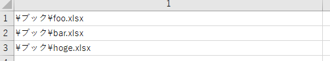
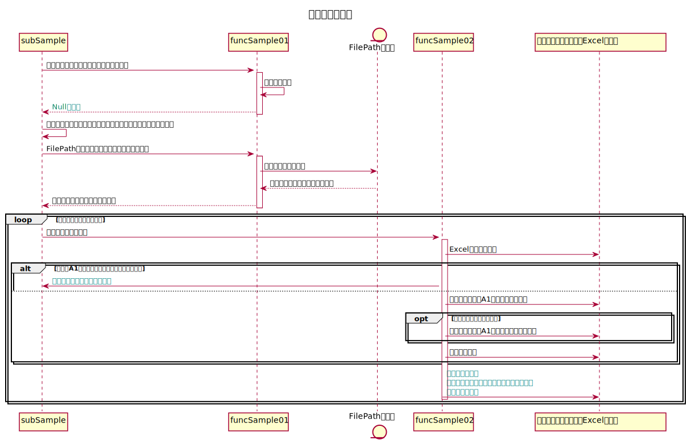
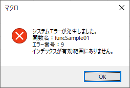
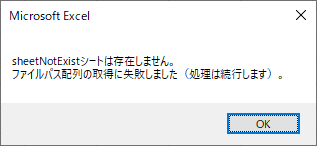
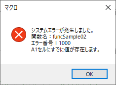
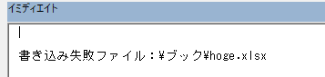

## この記事について

プログラミングにおいて、想定内のエラーが発生した場合に  
（あるいは自作のエラーを定義し、そのエラーが発生した際に）  
例外として専用の処理を行うという実装は一般的なものである。

VBAにも例外処理の機能は備わっているが、  
後発の言語よりも使用方法がややこしい部分があるため、  
この記事で典型的な例外処理のパターンのテンプレートと、  
使用例としてのサンプルを記したい。

[<span id="srcURL"><u>説明のために作成したExcelファイルとソースコード、テスト用データはこちらでダウンロードできます。</u></span>](https://github.com/dede-20191130/My_VBA_Tools/tree/master/Public/2020/12/Exception-Handling)

## 例外処理とは

### 例外処理の仕組み

例外処理が記述されていないプログラムを実行する場合について考える。

そのコードの処理を実行する際にエラーが発生すると、  
コンソールやファイルに出力したり、エラーメッセージが表示されるなど、  
環境によって既定の動作が起こり、  
そのエラーが発生した行において処理が中断したりする。

ツールやアプリケーションの場合、通常それはあまり好ましくない動作となる。  
なぜなら、エラーが起きたら今までの処理を復旧したり、ユーザにわからないようにリカバリーの処理を動かしたい場合があるため。

そのため、例外処理という特別な処理の記述があると非常に便利になる。  
すなわち、正常時およびエラーが起きた場合で処理を分岐させ、  
それぞれの特別な処理というものを追加する。

### 例外処理の典型例（Pythonのコードによる）

#### try-except

例えばPythonだとこのように記述する[^1]。

```Python
def divide_each(a, b):
    try:
        print(a / b)
    except ZeroDivisionError as e:
        print('catch ZeroDivisionError:', e)
    except TypeError as e:
        print('catch TypeError:', e)

divide_each(1, 0)　#一回目の呼び出し
# catch ZeroDivisionError: division by zero

divide_each('a', 'b')　#二回目の呼び出し
# catch TypeError: unsupported operand type(s) for /: 'str' and 'str'
```

divide_each関数は  
2つの引数`a / b`の除算を計算し、  
その際に起こり得るエラーを捕捉（キャッチ）して  
それぞれ特有の処理を実行する。

捕捉される実行時エラーは、

- 分母がゼロだった場合のエラー（ZeroDivisionError）
- 引数に数字以外の型の値を指定し、除算ができない場合のエラー（TypeError）

であり、  
前者の場合はコンソール（標準出力）に「catch ZeroDivisionError: division by zero」と出力され、  
後者の場合は「catch TypeError: unsupported operand type(s) for ...」と出力される。

このようなPythonの構文を「try-except」と呼ぶ。

#### finallyによる終了時処理

正常に処理が進んだ場合も、エラーが発生してexcept句でキャッチされた場合も、  
共通で終了時に必ず実行される処理を行いたい場合は、  
次のように「finally句」を追加する。

```python
def divide_each(a, b):
    try:
        print(a / b)
    except ZeroDivisionError as e:
        print('catch ZeroDivisionError:', e)
    except TypeError as e:
        print('catch TypeError:', e)
    finally:
        print('passed end processing')


divide_each(1, 0)
# catch ZeroDivisionError: division by zero

divide_each('a', 'b')
# catch TypeError: unsupported operand type(s) for /: 'str' and 'str'

```

これを実行すると、  
次のようにコンソールに出力される。

```language
catch ZeroDivisionError: division by zero
passed end processing
catch TypeError: unsupported operand type(s) for /: 'str' and 'str'
passed end processing
```


## VBAにおける例外処理

### 特徴

VBAの場合、  
煩雑なことに、Pythonの場合のtry-except構文のように  
定形構文の形で例外処理が定義されていない。  

これはつまり、エラーが起きたらコード上のどの行にジャンプし、  
その後終了処理としてどの行にジャンプするのかということを  
自力で定義しなければならないということである。

そのために用いるステートメントとして、  
GotoステートメントおよびOn Errorステートメントというものが存在する。  

||||
|-|-|-|
|Gotoステートメント|プロシージャ内で<br>ラベルを貼られた行に<br>無条件で移動する|[Official Link](https://docs.microsoft.com/ja-jp/office/vba/language/reference/user-interface-help/goto-statement)|
|On Errorステートメント|エラー発生時のプログラムの挙動を定義する。<br>Gotoと組み合わせてエラー発生時に指定の行に移動したり、<br>エラー時の分岐処理自体を無効化させたりする。|[Official Link](https://docs.microsoft.com/ja-jp/office/vba/language/reference/user-interface-help/on-error-statement)|

### テンプレート

VBAには、  
SubプロシージャとFunctionプロシージャという、  
大きく二種類のプロシージャが存在する。

それぞれに対して、  
典型的な例外処理のテンプレートを記したい。

#### Subプロシージャ

```vb
'******************************************************************************************
'*関数名    ：Subプロシージャの例外処理テンプレート
'*機能      ：
'*引数      ：
'******************************************************************************************
Public Sub subTemplate()
    
    '定数
    Const FUNC_NAME As String = "subTemplate"
    
    '変数
    
    On Error GoTo ErrorHandler

    '---ここから処理を記載する---
    

ExitHandler:
    
    '---ここから終了処理を記載する---
    
    Exit Sub
    
ErrorHandler:
    
    '---ここから例外発生時処理を記載する---
    '　　例：メッセージボックス表示、
    '　　　　ログファイルにシステムエラー情報書き込み、
    '　　　　システムエラー発生の通知メールの作成・発信など
    
    MsgBox "システムエラーが発生しました。" & _
           vbLf & _
           "関数名：" & FUNC_NAME & _
           vbLf & _
           "エラー番号：" & Err.Number & vbNewLine & _
           Err.Description, vbCritical, "マクロ"
        
    GoTo ExitHandler
        
End Sub
```

`On Error GoTo ErrorHandler`の宣言によって、  
エラー発生時にErrorHandler行ラベルに移動することが設定される。  
ErrorHandlerは上記のPythonコードにおけるexcept句に相当する。

ログファイルへの書き込みやメッセージ表示などのエラー処理の終了後、  
GoTo ExitHandlerの命令によって  
終了処理に移動する。  
これは、上記のPythonコードにおけるfinally句に相当する。

#### Functionプロシージャ

Functionプロシージャの場合、  
呼び出し元の関数にエラーが発生したことを伝達する方法によって  
二種類のテンプレートが考えられる。

##### テンプレート①

```vb
'******************************************************************************************
'*関数名    ：Functionプロシージャの例外処理テンプレート(1)
'*機能      ：
'*引数      ：
'*戻り値    ：True > 正常終了、False > 異常終了
'******************************************************************************************
Public Function functionTemplate01() As Boolean
    
    '定数
    Const FUNC_NAME As String = "functionTemplate01"
    
    '変数
    
    On Error GoTo ErrorHandler

    functionTemplate01 = False
    
    '---ここから処理を記載する---

TruePoint:
    
    '---ここから正常時のみの終了処理を記載する---
    
    functionTemplate01 = True

ExitHandler:
    
    '---ここから終了処理を記載する---
    
    Exit Function
    
ErrorHandler:

    '---ここから例外発生時処理を記載する---
    '　　例：メッセージボックス表示、
    '　　　　ログファイルにシステムエラー情報書き込み、
    '　　　　システムエラー発生の通知メールの作成・発信など
    
    MsgBox "システムエラーが発生しました。" & _
           vbLf & _
           "関数名：" & FUNC_NAME & _
           vbLf & _
           "エラー番号：" & Err.Number & vbNewLine & _
           Err.Description, vbCritical, "マクロ"
        
    GoTo ExitHandler
        
End Function
```

Subプロシージャのテンプレートとの違いは、  
Boolean型の関数の戻り値が存在し、Trueならば正常終了、Falseならば異常終了となることである。  

エラー発生時では`functionTemplate01 = True`を通過しないため  
呼び出し元の関数に、異常終了という形でエラーが伝達される。  

```vb
if not functionTemplate01() then Call Msgbox("関数呼び出しが不正です。")
```

また、TruePoint行ラベルが追加され、  
処理の途中で正常終了としてプロシージャを抜けたい場合に  
`Exit Sub`の代わりに`Goto TruePoint`の命令を記述し、  
正常終了としてこのプロシージャを抜ける。


##### テンプレート②

```vb
'******************************************************************************************
'*関数名    ：Functionプロシージャの例外処理テンプレート(2)
'*機能      ：
'*引数      ：
'*戻り値    ：任意の指定の基本型 > 正常終了、Null > 異常終了
'******************************************************************************************
Public Function functionTemplate02() As Variant
    
    '定数
    Const FUNC_NAME As String = "functionTemplate02"
    
    '変数
    
    On Error GoTo ErrorHandler

    functionTemplate02 = Null
    
    '---ここから処理を記載する---

ExitHandler:
    
    '---ここから終了処理を記載する---
    
    Exit Function
    
ErrorHandler:

    '---ここから例外発生時処理を記載する---
    '　　例：メッセージボックス表示、
    '　　　　ログファイルにシステムエラー情報書き込み、
    '　　　　システムエラー発生の通知メールの作成・発信など
    
    MsgBox "システムエラーが発生しました。" & _
           vbLf & _
           "関数名：" & FUNC_NAME & _
           vbLf & _
           "エラー番号：" & Err.Number & vbNewLine & _
           Err.Description, vbCritical, "マクロ"
        
    GoTo ExitHandler
        
End Function
```

Subプロシージャのテンプレートとの違いは、  
Variant型の関数の戻り値が存在し、Null以外の任意の型の戻り値ならば正常終了、Nullが返れば異常終了と判定できることである。  

処理の最初に`functionTemplate02 = Null`としてNUllを代入し、  
処理の途中で関数として戻したい値を代入する。  
特に戻り値が必要なければ空欄でも代入しておけば良い。

呼び出し元の関数で、異常終了を検知する場合は  
`isNull`関数を用いる。

```vb
Dim returnValue as Variant
returnValue = functionTemplate02()
if isNull(returnValue) then Call Msgbox("関数呼び出しが不正です。")
```

### 使用例のサンプル

#### サンプルの動作

1. funcSample01プロシージャを呼び出す。  
funcSample01プロシージャの動作：  
　Excelファイルのシートから、  
　ファイルパスの文字列を配列として取得。
2. funcSample02プロシージャを呼び出す。  
funcSample02プロシージャの動作：   
　引数で指定されたパスのExcelファイルを開く。  
　さらに、一枚目と二枚目のシートのA1セルに情報を書き込み、閉じる。

これらの関数内におけるエラーの発生と例外処理の流れを記したい。

#### 使用環境

Windows 10 Home(64bit)  
MSOffice 2016

#### Excelファイルとテスト用データについて

コードの記載されたExcelファイルのFilePathシートには  
テスト用データのファイルの相対パスが記載されている。



テスト用データfoo、barのExcelファイルは  
一枚目のシートのA1セルが空欄であり、  
hogeファイルは一枚目のシートのA1セルに「あいうえお」と記入されている。

bar.xlsxは二枚目のシートが存在する。

#### 処理フロー図



#### コード

##### 呼び出し元のSubプロシージャ

```vb
'******************************************************************************************
'*関数名    ：例外処理Subプロシージャ実例
'*機能      ：
'*引数      ：
'******************************************************************************************
Public Sub subSample()
    
    '定数
    Const FUNC_NAME As String = "subSample"
    
    '変数
    Dim filePathArr As Variant
    Dim filePath As Variant
    Dim sheetName As String
    
    On Error GoTo ErrorHandler
    
    Application.ScreenUpdating = False
    
    'funcSample01の呼び出し　存在しないシート名の引数で呼び出す
    sheetName = "sheetNotExist"
    filePathArr = funcSample01(sheetName)
    '戻り値がNullであるためメッセージ表示
    If IsNull(filePathArr) Then MsgBox sheetName & "シートは存在しません。" & vbNewLine & "ファイルパス配列の取得に失敗しました（処理は続行します）。"
    
    'funcSample01の呼び出し　存在するシート名の引数で呼び出す
    sheetName = "FilePath"
    filePathArr = funcSample01(sheetName)
    '戻り値がNullではないため失敗の表示なし
    If IsNull(filePathArr) Then MsgBox sheetName & "シートは存在しません。" & vbNewLine & "ファイルパス配列の取得に失敗しました（処理は続行します）。"
    
    'それぞれのExcelファイルについて、funcSample02を呼び出す
    For Each filePath In filePathArr
        'funcSample02の呼び出し
        'すでにA1セルが書き込まれていた場合は、イミディエイトウィンドウに失敗したファイルパスを出力
        If Not funcSample02(ThisWorkbook.Path & filePath) Then
            Debug.Print "書き込み失敗ファイル：" & filePath
        End If
    Next filePath
    
    
    '■■■funcSample01,funcSample02などでキャッチできなかった想定外のエラーは
    '　　　このプロシージャのErrorHandler行ラベルでキャッチされます。
    
ExitHandler:
    
    Application.ScreenUpdating = True
    
    Exit Sub
    
ErrorHandler:

    MsgBox "システムエラーが発生しました。" & _
           vbLf & _
           "関数名：" & FUNC_NAME & _
           vbLf & _
           "エラー番号：" & Err.Number & vbNewLine & _
           Err.Description, vbCritical, "マクロ"
        
    GoTo ExitHandler
        
End Sub
```

##### funcSample01プロシージャ

```vb
'******************************************************************************************
'*関数名    ：例外処理Functionプロシージャ実例(1)
'*機能      ：ファイルパスの文字列を配列として取得
'*引数      ：このファイルのシートの名前
'*戻り値    ：文字列の配列 > 正常終了、Null > 異常終了
'******************************************************************************************
Public Function funcSample01(ByVal wsName As String) As Variant
    
    '定数
    Const FUNC_NAME As String = "funcSample01"
    
    '変数
    
    On Error GoTo ErrorHandler

    funcSample01 = Null
    
    '指定されたシートのA1セルからA3セルまでの値を配列として取得する
    With ThisWorkbook.Worksheets(wsName)
        funcSample01 = .Range("A1:A3").Value
    End With

ExitHandler:
    
    
    Exit Function
    
ErrorHandler:

    MsgBox "システムエラーが発生しました。" & _
           vbLf & _
           "関数名：" & FUNC_NAME & _
           vbLf & _
           "エラー番号：" & Err.Number & vbNewLine & _
           Err.Description, vbCritical, "マクロ"
        
    GoTo ExitHandler
        
End Function
```

テンプレートの項でも記載したように、  
正常終了ならばfuncSample01の戻り値はファイルパス文字列配列であり、  
異常終了ならばNullである。

戻り値がNullの場合、  
呼び出し元のsubSampleプロシージャにおいて、  
「ファイルパス配列の取得に失敗しました（処理は続行します）」のメッセージが表示される。  

##### funcSample02プロシージャ

```vb
'******************************************************************************************
'*関数名    ：例外処理Functionプロシージャ実例(2)
'*機能      ：指定されたパスのエクセルファイルを開く
'               一枚目のシートのA1セルに時刻を書き込む
'               二枚目のシートが存在すれば、二枚目のA1セルに「完了」と書き込む
'*引数      ：エクセルファイルのパス
'*戻り値    ：True > 正常終了、False > 異常終了
'******************************************************************************************
Public Function funcSample02(ByVal filePath As String) As Boolean
    
    '定数
    Const FUNC_NAME As String = "funcSample02"
    
    '変数
    Dim wb As Workbook
    
    On Error GoTo ErrorHandler

    funcSample02 = False
    
    Set wb = Workbooks.Open(filePath)
    
    
    With wb
        '一枚目のシートのA1セルに時刻を書き込む
        'すでにA1セルに文字が書き込まれていた場合はエラーとなる（異常終了）
        If Trim(.Worksheets(1).Range("A1").Value) <> "" Then Err.Raise 1000, , "A1セルにすでに値が存在します。"
        .Worksheets(1).Range("A1").Value = Now
        
        '二枚目のシートが存在しなければ終了（正常終了）
        If .Worksheets.Count < 2 Then GoTo TruePoint
        
        '二枚目のA1セルに「完了」と書き込む
        .Worksheets(2).Range("A1").Value = "完了"
        
    End With
    

TruePoint:
    
    'シートの保存
    wb.Save
    
    funcSample02 = True

ExitHandler:
    
    '正常終了時でもエラーが起きた場合でも、必ずブックを閉じる
    If Not wb Is Nothing Then wb.Close SaveChanges:=False
    
    Exit Function
    
ErrorHandler:

    MsgBox "システムエラーが発生しました。" & _
           vbLf & _
           "関数名：" & FUNC_NAME & _
           vbLf & _
           "エラー番号：" & Err.Number & vbNewLine & _
           Err.Description, vbCritical, "マクロ"
        
    GoTo ExitHandler
        
End Function

```

テンプレートの項でも記載したように、  
正常終了ならばfuncSample01の戻り値はTrueであり、  
異常終了ならばFalseである。

ここで、例外処理の強みの一つである、  
「エラー発生時に今までの動作の復旧を図る」処理が記されている。  
```vb
ExitHandler:
    '正常終了時でもエラーが起きた場合でも、必ずブックを閉じる
    If Not wb Is Nothing Then wb.Close SaveChanges:=False
```
この部分で、  
正常終了時でもエラー発生時の挙動においても  
必ずブックを閉じるようにしているため、  
ブックが閉じられないまま残ってしまうという事態を  
避けることができる。

また、二枚目の処理が行われるのは、  
テスト用データのブックにシートが二枚以上存在する場合のみであり、  
もし一枚しかシートが存在しなければ、そのまま正常終了として終了処理に移動する。
```vb
'二枚目のシートが存在しなければ終了（正常終了）
If .Worksheets.Count < 2 Then GoTo TruePoint
```

また、戻り値がFalseの場合、  
呼び出し元のsubSampleプロシージャにおいて、  
イミディエイトウィンドウ（ログファイルの代わり）に失敗したファイルパスが出力される。  
```vb
If Not funcSample02(ThisWorkbook.Path & filePath) Then
    Debug.Print "書き込み失敗ファイル：" & filePath
End If
```

#### 実際に実行すると

subSampleを実行する。

①  
sheetNotExistを引数としてfuncSample01を呼び出すと、  
システムエラーのメッセージと  
ファイルパス取得失敗のメッセージが表示される。

しかし、例外処理を適切に組み込んでいるため、  
処理が中断せずに次の行に続行することができる。

  



②  
funcSample02の呼び出しのループで  
hoge.xlsxを起動してA1セルに書き込もうとすると、  
すでに「あいうえお」と書き込まれているため、  
カスタムエラーのメッセージと  
イミディエイトウィンドウへのエラー情報出力が行われる。

  



しかし、こちらにおいても例外処理を適切に組み込んでいるため、  
処理が中断せずに次の行に続行することができる。

## サンプルとソースコードについて

<a href="#この記事について">こちらのリンク</a>をご参照ください。


[^1]: 引用元：[https://github.com/nkmk/python-snippets/blob/0bc3839319270c61ac37bd2112dd5996a4fe248b/notebook/exception_handling.py#L39-L51](https://github.com/nkmk/python-snippets/blob/0bc3839319270c61ac37bd2112dd5996a4fe248b/notebook/exception_handling.py#L39-L51)