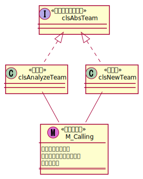
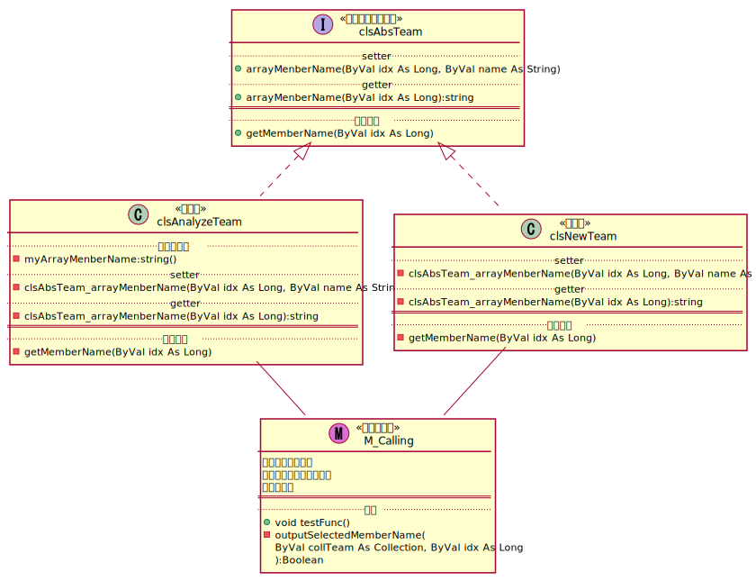

## この記事について

VBAではインタフェースを用いることによって、
オブジェクト指向のプログラミングをすることができる。

ただ、後述するように  
クラス変数に特徴的な制約があるため、  
継承したクラスにクラス変数として配列をもたせる場合に  
通常の変数と同じようにするとエラーとなる。

この記事で、その現象と、  
回避方法について記したい。

[<span id="srcURL"><u>説明のために作成したExcelファイルとソースコード、テスト用データはこちらでダウンロードできます。</u></span>](https://github.com/dede-20191130/My_VBA_Tools/tree/master/Public/2021/01/Interface-Array-Member)

## 作成環境

Windows 10 Home(64bit)  
MSOffice 2016

## 概要

### About

チームクラスインタフェース`clsAbsTeam`を実装したチームクラス`clsAnalyzeTeam`、`clsNewTeam`が存在する。

それぞれのチームクラスが、  
チームメンバー名前の格納用配列と、  
指定されたインデックスのチームメンバー名前を取得するメソッドを持つ。

### クラス図（変数・、メソッド記載無し）



## エラーの発生

### About

次のようにインタフェースと各継承先クラスを実装する。

```vb
'*** clsAbsTeam ***

Option Explicit

'**************************
'*チームクラスインタフェース
'**************************

'定数欄

'変数欄


'******************************************************************************************
'*getter/setter欄
'******************************************************************************************


Public Function getMemberName(ByVal idx As Long) As String

End Function

```

```vb
'*** clsAnalyzeTeam ***

Option Explicit

Implements clsAbsTeam

'**************************
'*チームクラス　解析チーム
'**************************

'定数欄

'変数欄


'******************************************************************************************
'*getter/setter欄
'******************************************************************************************


'******************************************************************************************
'*関数名    ：clsAbsTeam_getMemberName
'*機能      ：チームメンバーの名前取得
'*引数      ：対象者のインデックス番号
'*戻り値    ：チームメンバーの名前
'******************************************************************************************
Private Function clsAbsTeam_getMemberName(ByVal idx As Long) As String
    
    '定数
    
    '変数
    
    '***ここに名前取得の処理を入れる***
    
    
ExitHandler:

    Exit Function
        
End Function


```

```vb
'*** clsNewTeam ***

Option Explicit

Implements clsAbsTeam

'**************************
'*チームクラス　新設のチーム
'**************************

'定数欄

'変数欄


'******************************************************************************************
'*getter/setter欄
'******************************************************************************************


'******************************************************************************************
'*関数名    ：clsAbsTeam_getMemberName
'*機能      ：チームメンバーの名前取得
'*引数      ：対象者のインデックス番号
'*戻り値    ：チームメンバーの名前
'******************************************************************************************
Private Function clsAbsTeam_getMemberName(ByVal idx As Long) As String
    
    '定数
    
    '変数
    
    '***ここに名前取得の処理を入れる***
    
    
ExitHandler:

    Exit Function
        
End Function


```

ここで、チームメンバーの名前を収納するための配列をもたせるために、  
インタフェースにPublicなスコープの配列変数を定義しようとする。  

```vb
'*** clsAbsTeam ***

Option Explicit

'**************************
'*チームクラスインタフェース
'**************************

'定数欄

'変数欄
Public arrayMenberName(1 To 6) As String


'******************************************************************************************
'*getter/setter欄
'******************************************************************************************


Public Function getMemberName(ByVal idx As Long) As String

End Function

```

すると、   
定数、固定長文字列、配列、ユーザー定義型および Declare ステートメントは、  
オブジェクト モジュールのパブリック メンバーとしては使用できません。  
とのエラーが発生する。


### 原因

VBAの仕様上、  
配列やユーザ定義型などの一部の型の変数は、  
Publicのスコープで宣言することができるのは標準モジュールに限られる。  
それは、インタフェースで使用するクラスであっても同様のようである。

そのため、クラスのPrivateな配列に外部からアクセスできる仕組みを作らなければならない。

### 回避方法

インタフェースにはgetter/setterのみ定義し、  
継承先のクラスにPrivateなスコープの配列変数を所持させて、  
継承したgetter/setterを通してアクセスできるようにする。

```vb
'*** clsAbsTeam ***

Option Explicit

'**************************
'*チームクラスインタフェース
'**************************

'定数欄

'変数欄


'******************************************************************************************
'*getter/setter欄
'******************************************************************************************
Public Property Let arrayMenberName(ByVal idx As Long, ByVal name As String)

End Property

Public Property Get arrayMenberName(ByVal idx As Long) As String

End Property


Public Function getMemberName(ByVal idx As Long) As String

End Function

```

```vb
'*** clsAnalyzeTeam ***

Option Explicit

Implements clsAbsTeam

'**************************
'*チームクラス　解析チーム
'**************************

'定数欄

'変数欄
Private myArrayMenberName(1 To 6) As String


'******************************************************************************************
'*getter/setter欄
'******************************************************************************************
Private Property Let clsAbsTeam_arrayMenberName(ByVal idx As Long, ByVal name As String)
    myArrayMenberName(idx) = name
End Property

Private Property Get clsAbsTeam_arrayMenberName(ByVal idx As Long) As String
    clsAbsTeam_arrayMenberName = myArrayMenberName(idx)
End Property


'******************************************************************************************
'*関数名    ：clsAbsTeam_getMemberName
'*機能      ：チームメンバーの名前取得
'*引数      ：対象者のインデックス番号
'*戻り値    ：チームメンバーの名前
'******************************************************************************************
Private Function clsAbsTeam_getMemberName(ByVal idx As Long) As String
    
    '定数
    
    '変数
    
    clsAbsTeam_getMemberName = idx & "番目のチームメンバーは" & myArrayMenberName(idx) & "です。"
    
    
ExitHandler:

    Exit Function
        
End Function

```

```vb
'*** clsNewTeam ***

Option Explicit

Implements clsAbsTeam

'**************************
'*チームクラス　新設のチーム
'**************************

'定数欄

'変数欄


'******************************************************************************************
'*getter/setter欄
'******************************************************************************************
Private Property Let clsAbsTeam_arrayMenberName(ByVal idx As Long, ByVal name As String)
    '何もしない
End Property

Private Property Get clsAbsTeam_arrayMenberName(ByVal idx As Long) As String
    clsAbsTeam_arrayMenberName = "名前無し"
End Property

'******************************************************************************************
'*関数名    ：clsAbsTeam_getMemberName
'*機能      ：チームメンバーの名前取得
'*引数      ：対象者のインデックス番号
'*戻り値    ：チームメンバーの名前
'******************************************************************************************
Private Function clsAbsTeam_getMemberName(ByVal idx As Long) As String
    
    '定数
    
    '変数
    
    clsAbsTeam_getMemberName = "※新設のチームにはメンバーが存在しません。"
    
    
ExitHandler:

    Exit Function
        
End Function

```

上記のようにしてやれば、  
エラーを回避し、なおかつ予期した動作と同じ動作をする配列を継承先クラスに持たせることができる。

なお、新設チームクラスの場合はメンバーが居ないため、  
配列変数自体をクラスに持たせる必要がなく、持たせていない。

## サンプル

### クラス図



### コード（M_Calling）

```vb
'*** M_Calling ***

Option Explicit

'**************************
'*呼び出し元モジュール
'**************************


'******************************************************************************************
'*関数名    ：output3rdMemberName
'*機能      ：動作テスト
'*引数      ：
'*戻り値    ：True > 正常終了、False > 異常終了
'******************************************************************************************
Public Sub testFunc()
    
    '定数
    Const FUNC_NAME As String = "testFunc"
    
    '変数
    Dim team As clsAbsTeam
    Dim coll As New Collection
    
    On Error GoTo ErrorHandler

    '解析チームの名前を設定する
    Set team = New clsAnalyzeTeam
    team.arrayMenberName(1) = "佐藤"
    team.arrayMenberName(3) = "Mike"
    team.arrayMenberName(5) = "梦蝶"
    
    '処理するチームを追加
    coll.Add team
    coll.Add New clsNewTeam
    
    '名前を出力
    If Not outputSelectedMemberName(coll, 3) Then GoTo ExitHandler

ExitHandler:

    Exit Sub
    
ErrorHandler:

    MsgBox "エラーが発生したため、マクロを終了します。" & _
           vbLf & _
           "関数名：" & FUNC_NAME & _
           vbLf & _
           "エラー番号：" & Err.Number & vbNewLine & _
           Err.Description, vbCritical, "Interface-Array-Member"
        
    GoTo ExitHandler
        
End Sub


'******************************************************************************************
'*関数名    ：outputSelectedMemberName
'*機能      ：引数のコレクションの各チームの「idx」番目のメンバー名前を出力する
'*引数      ：
'*戻り値    ：True > 正常終了、False > 異常終了
'******************************************************************************************
Private Function outputSelectedMemberName(ByVal collTeam As Collection, ByVal idx As Long) As Boolean
    
    '定数
    Const FUNC_NAME As String = "outputSelectedMemberName"
    
    '変数
    Dim cntTeam As clsAbsTeam
    
    On Error GoTo ErrorHandler

    outputSelectedMemberName = False
    
    For Each cntTeam In collTeam
        Debug.Print cntTeam.getMemberName(idx)
    Next cntTeam

TruePoint:

    outputSelectedMemberName = True

ExitHandler:

    Exit Function
    
ErrorHandler:

    MsgBox "エラーが発生したため、マクロを終了します。" & _
           vbLf & _
           "関数名：" & FUNC_NAME & _
           vbLf & _
           "エラー番号：" & Err.Number & vbNewLine & _
           Err.Description, vbCritical, "Interface-Array-Member"
        
    GoTo ExitHandler
        
End Function


```

### 実行

テスト関数`testFunc`を実行すると、  
イミディエイトウィンドウに次のように出力される。

```
3番目のチームメンバーはMikeです。
※新設のチームにはメンバーが存在しません。
```

これにより、  
インタフェースを実装したクラスでも  
クラス変数として配列をもたせることが可能となることがわかった。

