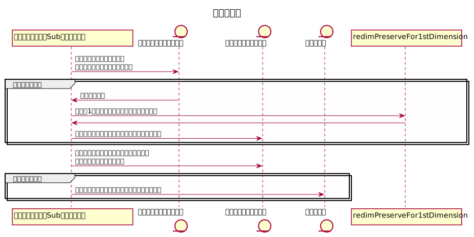

## この記事について

Excelにおいて  
通常セルから結合セルに対してコピーすると、  
「結合セルにこの操作は行えません」という警告がされ貼り付けができない。  

例えば下記画像の12列の「西川～竹田」を  
表のname列に貼り付けしようとしてもエラーとなる。


これを回避するには、  
コピー元セルも同じ結合様式にする（コピー先が2行3列の結合セルならば元のセルも2行3列にする）、  
あるいは VBAマクロにより機能を追加する 他には方法がなさそうなので、  
マクロを作成することにした。

## 作成環境

- windows10
- MSOffice 2016

## 要件

コピーしたいセル（コピー元）をクリップボードにコピーしたあとに実行して、  
選択中のセル（コピー先）に貼り付けしたい。

コピー元、コピー先ともに、どのような結合様式でも貼り付けできるようにする。

結合セルを取り込む際に、  
結合している左上のセル以外は空欄であるため、  
空欄のみの部分は除外できるようにしたい。

## 処理フロー



## コード

### 「結合セルにコピー」Subプロシージャ

```vb
'******************************************************************************************
'*機能      ：結合セルにコピーする
'               コピー元は通常セルでも結合セルでも可
'*引数      ：
'******************************************************************************************
Public Sub 結合セルにコピー()
    
    '定数
    Const FUNC_NAME As String = "結合セルにコピー"
    
    '変数
    Dim arr() As Variant
    Dim row As Long: row = 0
    Dim col As Long: col = 1
    Dim dicIgnoreRow As Object: Set dicIgnoreRow = CreateObject("Scripting.Dictionary")
    Dim dicIgnoreCol As Object: Set dicIgnoreCol = CreateObject("Scripting.Dictionary")
    
    On Error GoTo ErrorHandler
        
    'テキスト形式であるかチェック
    If Application.ClipboardFormats(1) <> xlClipboardFormatText Then MsgBox "クリップボードのデータがテキストではありません。", vbExclamation, FUNC_NAME: GoTo ExitHandler
        
    '1 - クリップボードから配列にデータを移す
    '       vbNewLineを行区切り、
    '       vbTabを列区切りとして、
    '       二次元配列に格納する
    With CreateObject("new:{1C3B4210-F441-11CE-B9EA-00AA006B1A69}")
        
        .GetFromClipboard
        Dim c, d
        ReDim arr(1 To 1, 1 To 1)
        For Each c In Split(.GetText, vbNewLine)
            row = row + 1
            If row > 1 Then arr = redimPreserveFor1stDimension(arr, row)
            'currentCol:現在格納の対象とする列インデックス
            Dim currentCol As Long: currentCol = 0
            For Each d In Split(c, vbTab)
                currentCol = currentCol + 1
                If currentCol > col Then
                    col = col + 1
                    ReDim Preserve arr(1 To row, 1 To col)
                End If
                arr(row, currentCol) = Trim(d)
            Next d
        Next c
    End With
    
    '2 - 空欄のみの行、空欄のみの列を記録し、
    '貼り付けする際に除外する
    
    '行の除外チェック
    Dim i, j As Long
    Dim isIgnore As Boolean
    For i = 1 To UBound(arr)
        isIgnore = True
        For j = 1 To UBound(arr, 2)
            '対象要素が空欄でなければその行は貼り付けから除外しない
            If Trim(arr(i, j)) <> "" Then isIgnore = False: Exit For
        Next j
        If isIgnore Then dicIgnoreRow.Add i, True
    Next i
    '列の除外チェック
    For j = 1 To UBound(arr, 2)
        isIgnore = True
        For i = 1 To UBound(arr)
            '対象要素が空欄でなければその列は貼り付けから除外しない
            If Trim(arr(i, j)) <> "" Then isIgnore = False: Exit For
        Next i
        If isIgnore Then dicIgnoreCol.Add j, True
    Next j
    
    '3 - 選択しているセルを起点として配列を貼付する
    Dim k, l As Long
    Dim r, tmp As Range
    Set r = Selection(1)
    For k = 1 To UBound(arr): Do
        '除外する行ならばcontinueする
        If dicIgnoreRow.exists(k) Then Exit Do
        '現在のアドレスの範囲を保持
        Set tmp = r
        
        For l = 1 To UBound(arr, 2): Do
            '除外する列ならばcontinueする
            If dicIgnoreCol.exists(l) Then Exit Do
            '貼り付け
            r.Value = arr(k, l)
            '貼り付け先を一つ右の列に移す
            Set r = r.Offset(, 1)
        Loop While False: Next l
        '貼り付け先を一つ下の行に移す
        Set r = tmp.Offset(1)
    Loop While False: Next k
    
    Application.CutCopyMode = False
    
ExitHandler:

    Exit Sub
    
ErrorHandler:

    MsgBox "エラーが発生したため、マクロを終了します。" & _
           vbLf & _
           "関数名：" & FUNC_NAME & _
           vbLf & _
           "エラー番号：" & Err.Number & vbNewLine & _
           Err.Description, vbCritical, "マクロ"
        
    GoTo ExitHandler
        
End Sub

```


### 「redimPreserveFor1stDimension」Functionプロシージャ

```vb
'******************************************************************************************
'*機能      ：Redim Preserveステートメントの拡張
'               通常、二次元配列に対して
'               Redim Preserveステートメントは1次元目の要素数を変更できないため、
'               この関数を代わりに用いる
'*引数      ：対象配列
'*引数      ：一次元目の要素数の上限
'*戻り値    ：True > 正常終了、False > 異常終了
'******************************************************************************************
Private Function redimPreserveFor1stDimension(ByVal arr As Variant, ByVal sLen As Long) As Variant
    
    '定数
    Const FUNC_NAME As String = "redimPreserveFor1stDimension"
    
    '変数
    Dim tspsedArr As Variant
        
    On Error Resume Next
    
    'transposeにより対象配列を転置
    tspsedArr = WorksheetFunction.Transpose(arr)
    '二次元目を引数の長さまでRedimする（- A）
    ReDim Preserve tspsedArr(1 To UBound(tspsedArr, 1), 1 To sLen)

    redimPreserveFor1stDimension = WorksheetFunction.Transpose(tspsedArr)
    
    '(1 * N)行列を転置すると二次元目が消えて一次元の配列になるため、
    '（- A）の箇所でエラーになる
    'その場合は代わりに下記のように処理を行う
    If Err.Number = 9 Then
        Dim newArr As Variant
        Dim i As Long
        Err.Clear
        On Error GoTo ErrorHandler
        ReDim newArr(1 To UBound(arr, 1) + 1, 1 To 1)
        '既存の値を反映する
        For i = 1 To UBound(arr, 1)
            newArr(i, 1) = arr(i, 1)
        Next i
        redimPreserveFor1stDimension = newArr
    End If
    
ExitHandler:

    Exit Function
    
ErrorHandler:

    MsgBox "エラーが発生したため、マクロを終了します。" & _
           vbLf & _
           "関数名：" & FUNC_NAME & _
           vbLf & _
           "エラー番号：" & Err.Number & vbNewLine & _
           Err.Description, vbCritical, "マクロ"
        
    GoTo ExitHandler
        
End Function
```

## アドインに登録

下記のように、  
マクロをアドインに登録して  
ワンクリックで呼び出せるようにすると使いやすい。


アドインの登録方法については  
こちらのサイト様の詳細な記事が参考になる。  
[Excelアドインの作成と登録について｜VBA技術解説](https://excel-ubara.com/excelvba4/EXCEL297.html)

## 使用方法

1. コピーしたい範囲をコピーする。
2. 貼り付けしたい範囲の左上のセルを選択する。
3. 関数を実行する。


## デモ

### (i) 通常セルから結合セルにコピー

下記のように、  
西川～竹田をctrl + cなどでコピーした後に  
表のNo5のname列を選択状態で関数実行し、  
name列にコピペできる。


### (ii) 結合セルから通常セルにコピー

下記のように  
表のNo1～No4のaddress列のデータを青色部分セルにコピペできる。


### (iii) 結合セルから結合セルにコピー

結合セル同士でも問題なく処理可能。

下記のように  
オレンジ色部分の住所を、  
表のNo5～No7のaddress列にコピペできる。


