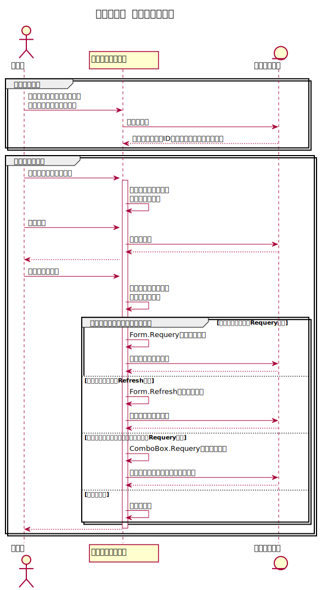

## この記事について

 
    フォームでのデータ編集後、<br>
    Requeryを使うかRefreshを使うかで結果は異なる。<br>
    <br>
    Refreshを使用するのが最も使い勝手が良さそう。<br>


Accessのフォームにおいて、  
データの更新をした後に追加で更新の反映処理を行わないと  
意図したとおりにデータが表示されないことはしばしばある。

更新処理としてはフォームのRequeryメソッドとコントロールのRequeryメソッド、  
さらにフォームのRefreshメソッドが存在するが、  
どれを使用するかということは、ケースバイケースだ。

この記事で、単票フォーム上のデータの編集の反映というフェーズに焦点を当て、  
それぞれの挙動を切り分けてみたい。  
動作の確認にはデモツールを使用する。

[<span id="srcURL"><u>説明のために作成したデモツール（Accessファイル）とソースコードはこちらでダウンロードできます。</u></span>](https://github.com/dede-20191130/My_VBA_Tools/tree/master/Public/2021/08/cut-sheet-requery-refresh)


## 環境

- windows10
- MSOffice2019

## デモ

### デモツールについて
#### 画面


#### 内容

商品管理フォームは商品テーブルをレコードソースとする。

商品名選択コンボボックス（非連結コントロール）はIDおよび商品名をソースとしており、  
選択値によりフォームに単票として表示するレコードを切り替える。

通常モードでは項目の変更は不可。

編集モード開始ボタンを押下して編集モードに切り替える。  
編集モード時、項目の変更は可能。

編集完了ボタン押下し、  
編集を終え通常モードに切り替える。

「編集完了時の挙動」内のラジオボタンを選択することで  
どのような更新処理をするかを選択できる。

#### シーケンス



#### コード（一部抜粋）

##### 編集モード開始ボタン（編集完了ボタン）押下時処理

```vb

'******************************************************************************************
'*機能      ：編集モード開始ボタン押下
'*引数      ：
'*戻り値    ：True > 正常終了、False > 異常終了
'******************************************************************************************
Private Sub btn_edit_Click()

    '定数
    Const FUNC_NAME As String = "btn_edit_Click"
    
    '変数
    
    On Error GoTo ErrorHandler

    '//編集モード開始
    If Me.txt_productName.Locked Then
        '//可視性
        Me.lbl_product.Visible = False
        Me.cmb_product.Visible = False
        Me.lbl_onEdit.Visible = True
        '//ロック
        Me.txt_productName.Locked = False
        Me.txt_productCode.Locked = False
        Me.txt_nouhinDay.Locked = False
        '//ラベル
        Me.btn_edit.Caption = "編集完了"
    '//編集完了
    Else
        '//可視性
        Me.lbl_product.Visible = True
        Me.cmb_product.Visible = True
        Me.lbl_onEdit.Visible = False
        '//ロック
        Me.txt_productName.Locked = True
        Me.txt_productCode.Locked = True
        Me.txt_nouhinDay.Locked = True
        '//ラベル
        Me.btn_edit.Caption = "編集モード開始"
        
        '****************************************************
        '//編集完了後の挙動フレームの選択値によって処理を分岐
        Select Case Nz(Me.frm_finishEdition.Value, 1)
        '////フォームに対してRequery実行
        Case 2
            Me.Requery
        '////フォームに対してRefresh実行
        Case 3
            Me.Refresh
        '////商品名選択コンボボックスに対してRequery実行
        Case 4
            Me.cmb_product.Requery
        End Select
        '****************************************************
        
    End If


ExitHandler:

    Exit Sub
    
ErrorHandler:

    MsgBox "エラーが発生したため、マクロを終了します。" & _
           vbLf & _
           "関数名：" & FUNC_NAME & _
           vbLf & _
           "クラス名：" & SOURCE_NAME & _
           vbLf & _
           "エラー番号：" & Err.Number & vbNewLine & _
           Err.Description, vbCritical, "cut-sheet-requery-refresh"
        
    GoTo ExitHandler
        
End Sub

```

##### 商品名選択コンボボックスの値集合ソース（RowSource）

```nostyle

SELECT PRODUCT_TABLE.ID,
    PRODUCT_TABLE.商品名
FROM PRODUCT_TABLE
ORDER BY PRODUCT_TABLE.ID;

```

プロパティについては、
連結列を1、  
列数を2（0cmおよび3cm幅）としている。

表示上は商品名だが、  
実際にボックスに格納されている値はID（数値）である。

### 前提

次のように、  
- ネジ
- ボルト
- 電気工事

の三種類の商品レコードが存在するとする。


### i. 何もしない場合

編集完了後、  
商品名の変更が商品名選択コンボボックスの項目リストに反映されない。  
（下記動画参照）

したがって、  
何もしなければ、  
コンボボックスのソースが更新されることはない。



せっかく商品名を変えたのに、選択肢に変更した名前が現れないので、ユーザは混乱するだろう。

### ii. フォームに対してRequery実行する場合

編集完了ボタンを押下した後、  
強制的にテーブルの最も若いIDのレコード（ネジのレコード）に移動する。

これは、  
フォームに対するRequeryの意味するところが、  
フォームの属するレコードソース（テーブルあるいはクエリ）の再読み込みを意味するためである。  
すべてのレコードを読み込むため、カレントレコードは先頭に移動する。



「i. 何もしない場合」と異なり  
コンボボックスの項目リストは更新されているが、  
いきなり先頭のレコードに飛ぶため、ユーザは戸惑うかもしれない。  

また、商品名選択コンボボックスの値はいまだ「ナット」を指しているため  
微細ではあるが不整合が生まれている。

### iii. フォームに対してRefresh実行する場合

編集完了ボタンを押下した後、  
商品名の変更が商品名選択コンボボックスの項目リストに反映される。  

この場合、レコードの移動は生じない。

これは、  
フォームに対するRefreshの意味するところが、  
カレントレコードの更新であり、  
他のレコード部分はタッチしないからである。



実行速度の観点からも、  
このような編集の場合はこの方法がベストソリューションかと思う。


### iv. 商品名選択コンボボックスに対してRequery実行する場合

これはやや奇妙な挙動をする。

編集完了ボタンを押下した後、  
商品名選択コンボボックスの値（表示されている文字列）はボルトのままであり、  
更新されていない。

コンボボックスを展開しても、項目リストは以前のままである。

ここでコンボボックスをネジに変更すると、  
コンボボックスの項目リストは更新されている。



商品名選択コンボボックスに対してのみRequeryメソッドを実行しているため、  
内部で項目リスト自体は更新されているが、  
画面上での表示は更新されないため、リストが更新されていないように見える。  

選択値をネジに変えた時点で表示の更新が起こり、リストは新しいものとして表示されることができる。


## まとめ

ユーザが編集操作をした後のことを考えると、  
Refreshが最も自然で使い勝手が良さそうな印象を受ける。

個別のコントロールに対するRequeryは、  
表示自体を変更しないかもしれないが、  
マクロあるいはVBAの処理途中で再度コントロールのプロパティを参照したい場合など、  
見え方にこだわらないような場合では、  
一番速く簡潔な選択肢になるかもしれない。

