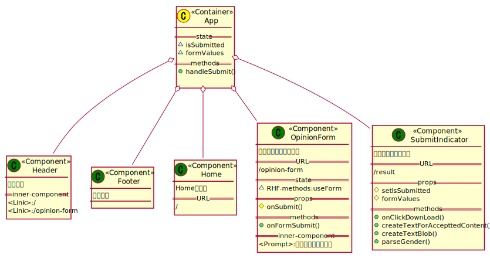

## この記事について

 
    以前作成したReact製フォームをReact RouterでSPA化した。  
    モーダルポップアップとして表示していた結果画面を別ページに移し、モーダル特有の問題からも解放された。


[先日作成したReact製意見送信フォーム]()では、  
フォームのSubmit後にモーダルポップアップとして送信完了および結果の取得ボタンを表示していたが、  
実はモーダル画面特有の問題を抱えていた。

問題： 
- （必須）モーダル以外の部分を操作できたら困るので  
モーダル表示時、モーダル部分の要素のみフォーカスできるように固定しなければならない（Focus Trap）
- （オプション）WAI-ARIA対応としてアクセシビリティ向上のために、モーダルのコンポーネントにaria属性の設定などが必要

上記のそれぞれの問題については[こちら]()では対応していないので、  
モーダルを使うのをやめてSPA化して別のページにしてしまうことを考え、作成することとした。

SPA化のためには[React Router](https://reactrouter.com/web/guides/quick-start)を使用している。

[<span id="srcURL"><u>ソースコードはこちらにあります（GitHub）。</u></span>](https://github.com/dede-20191130/send-contact-form-react-router)

## レスポンシブ対応について

PCでの閲覧のみ対応。  
スマホ対応などではレイアウトが崩れる。

## 要件の変更

SPAするにあたり、次のように要件を変更し、機能追加するようにした。

- 構成の変更
  - Home画面を追加する
  - ヘッダー、フッターを追加する
  - 送信の結果表示画面をモーダルから単独のページに変更
- 動作の変更
  - フォームが入力済みの場合、他のページに遷移する際に警告を表示するようにする
  - 結果表示ページはフォーム上でSubmitした場合にのみ表示（URL指定で遷移しようとした場合はHomeにリダイレクトする）


## 設計
### クラス設計

#### About

フォームのロジックや、受理内容.txtファイルの作成ロジックなどは変更なし。  
Appコンポーネントと各childコンポーネントとのデータのI/Oを一部変更  
（こちらのほうが前回よりもI/O周りがすっきりしている印象）。

#### クラス図



## 実装

### 作成環境

```
node v14.16.1
npm 6.14.12
create-react-app
```
### 依存パッケージ

一部抜粋。

```json{hl_lines=[10]}
{
    "dependencies":{
        "react": "^17.0.2",
    "react-dom": "^17.0.2",
    "react-scripts": "4.0.3",
    "typescript": "^4.4.3",
    "moment": "^2.29.1",
    "node-sass": "^6.0.1",
    "react-hook-form": "^7.16.1",
    "react-router-dom": "^5.3.0"
   }
}

```

### ディレクトリ構成

一部抜粋。

```
my-app
│  package-lock.json
│  package.json
│  tsconfig.json
│  
├─node_modules
│          
├─public
│      index.html
│      
└─src
    │  index.tsx
    │  react-app-env.d.ts
    │  setupTests.ts
    │  
    ├─style
    │      style.scss
    │      _active.scss
    │      _footer.scss
    │      _form.scss
    │      _header.scss
    │      _main-section.scss
    │      _mixin.scss
    │      _result.scss
    │      _variables.scss
    │      
    └─ts
        │  App.test.tsx
        │  App.tsx
        │  
        ├─error-pages
        │      nomatch.tsx
        │      
        ├─form
        │      opinion-form.test.tsx
        │      opinion-form.tsx
        │      
        ├─header
        │      footer.tsx
        │      header.tsx
        │      
        ├─home
        │      home.tsx
        │      
        └─result-page
                submit-indicator.test.tsx
                submit-indicator.tsx
                
```

### コード


ソースコードの全体は[こちらから](#srcURL)


#### App Component

Routerライブラリを用いて、  
指定されたURLごとに表示するページを切り分けている。  

|||
|-|-|
|/|Homeページ|
|/opinion-form|フォームページ|
|/result|送信結果表示ページ|


画面遷移のナビゲートの役割は`Header Component`が持っている。

"/result"のURLにはフォームSubmit時のみ移動できるようにしているため、  
条件が揃わなければリダイレクトさせる。

```ts
function App() {
    const [isSubmitted, setIsSubmitted] = useState(false);
    const [formValues, setFormValues] = useState<accepttedContentData>(
        {} as accepttedContentData
    );
    const handleSubmit = useCallback(
        (data: IFormInput) => {
            setFormValues({
                name: data.fname,
                gender: data.fgender,
                age: data.fage,
                address: data.faddress,
                message: data.fmessage,
            });

            setIsSubmitted(true);
        },
        [setIsSubmitted]
    );

    return (
        <>
            <Header />
            <main>
                <div className="content">
                    <Switch>
                        <Route exact path="/">
                            <Home />
                        </Route>
                        <Route path="/opinion-form">
                            <div className="normal-form-container">
                                <OpinionForm onSubmit={handleSubmit}></OpinionForm>
                            </div>
                        </Route>
                        <Route path="/result">
                            {isSubmitted ? (
                                <SubmitIndicator
                                    formValues={formValues}
                                    setIsSubmitted={setIsSubmitted}
                                />
                            ) : (
                                <Redirect to="/" />
                            )}
                        </Route>
                        {/* for dev */}
                        {process.env.NODE_ENV === "development" && (
                            <DevResultDummyData />
                        )}
                        {/* 404 error page */}
                        <Route path="*">
                            <NoMatch />
                        </Route>
                    </Switch>
                </div>
            </main>
            <Footer />
        </>
    );
}
```

#### Header Component

`Link Component`により画面遷移をナビゲートする。

今回はHomeページとフォームページのみ。

```tsx
export function Header() {
    return (
        <header className="nav-header">
            <h1>Header</h1>
            <nav>
                <ul>
                    <li>
                        <Link to="/">Home</Link>
                    </li>
                    <li>
                        <Link to="/opinion-form">ご意見フォーム</Link>
                    </li>
                    {(process.env.NODE_ENV === "development") && (
                        <li>
                            <DevResultLink />
                        </li>
                    )}
                </ul>
            </nav>
        </header>
    )
}
```

#### OpinionForm Component

他画面遷移時に`Prompt Component`が働き、  
入力の中断を問い合わせる。

```tsx

export function OpinionForm({ onSubmit }: OpinionFormArgs) {
    ......
    <Prompt
        when={isDirty && (!onSubmitting)}
        message={location =>
            `フォームに入力中です。${location.pathname}に移動しますか？`
        }
    />
    ......
}
```

#### SubmitIndicator Component

table要素内で送信結果をユーザに表示できるように変更した。

```ts
export function SubmitIndicator({
    formValues,
    setIsSubmitted,
}: ISubmitIndicatorArgs) {

    ......

    return (
        <>
            <div id="result-container">
                <div id="result-box">
                    <h2 id="result-message">ご意見を受け付けました。</h2>
                    <table>
                        <tbody>
                            <tr>
                                <td>氏名</td>
                                <td>{formValues.name}</td>
                            </tr>
                            <tr>
                                <td>性別</td>
                                <td>{parseGender(formValues.gender)}</td>
                            </tr>
                            <tr>
                                <td>年齢</td>
                                <td>{formValues.age} 歳</td>
                            </tr>
                            <tr>
                                <td>住所</td>
                                <td>{formValues.address}</td>
                            </tr>
                            <tr>
                                <td>ご意見内容</td>
                                <td>{formValues.message}</td>
                            </tr>
                        </tbody>
                    </table>
                    <p id="result-date">受理日時：{submiteedDate}</p>
                    <button
                        id="result-download"
                        onClick={onClickDownload}
                    >
                        送信内容のダウンロード
                    </button>
                </div>
            </div>
        </>
    );
}
```


## デモ（Vercel）

[Vercelにデプロイしました。](https://send-contact-form-react-router.vercel.app/)


