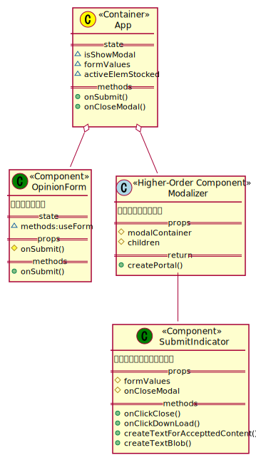

## この記事について

 
    ReactとReact関連ライブラリを用いて意見送信フォームを作成した。<br>
    特に、React-Hook-Formを用いるとバリデーション周りがかなり簡単に実装できた。


[先日作成した意見送信フォーム]()を、  
Reactを用いてリファクタした。

その際に、React-Hook-Formというフォーム作成用ライブラリを用いると  
短時間で高機能なフォームが作成できるという話を見たため、  
試してみることにした。

[<span id="srcURL"><u>ソースコードはこちらにあります（GitHub）。</u></span>](https://github.com/dede-20191130/send-contact-form-react)

## 設計

### クラス設計

#### About

Form用のComponentとModal用のComponentを用意する。  
上位のComponentで状態を管理し、表示/非表示を切り替える。

#### クラス図



## 実装

### 作成環境

```
node v14.16.1
npm 6.14.12
create-react-app
```
### 依存パッケージ

一部抜粋。

```json{hl_lines=[9]}
{
    "dependencies":{
        "react": "^17.0.2",
    "react-dom": "^17.0.2",
    "react-scripts": "4.0.3",
    "typescript": "^4.4.3",
    "moment": "^2.29.1",
    "node-sass": "^6.0.1",
    "react-hook-form": "^7.16.1"
   }
}

```

### ディレクトリ構成

一部抜粋。

```
my-app
│  package-lock.json
│  package.json
│  tsconfig.json
│              
├─node_modules
│          
├─public
│      index.html
│      
└─src
    │  index.css
    │  index.tsx
    │  react-app-env.d.ts
    │  setupTests.ts
    │  
    ├─style
    │      style.scss
    │      _active.scss
    │      _form.scss
    │      _mixin.scss
    │      _modal.scss
    │      _variables.scss
    │      
    └─ts
        │  App.test.tsx
        │  App.tsx
        │  
        ├─form
        │      opinion-form.test.tsx
        │      opinion-form.tsx
        │      
        └─modal
                modalizer.test.tsx
                modalizer.tsx
                submit-indicator.test.tsx
                submit-indicator.tsx
```

### コード


ソースコードの全体は[こちらから](#srcURL)

#### OpinionForm Component

```tsx
interface OpinionFormArgs {
    onSubmit: (data: IFormInput) => void;
}

export interface IFormInput {
    fname: string;
    fgender: string;
    fage: string;
    faddress: string;
    fmessage: string;
}
export function OpinionForm({ onSubmit }: OpinionFormArgs) {
    const {
        register,
        handleSubmit,
        formState: { errors, isSubmitSuccessful, submitCount },
        reset,
    } = useForm<IFormInput>({
        criteriaMode: "all",
        defaultValues: {
            fgender: "0",
        },
    });

    // submit時、上位Componentに処理を委譲
    const onFormSubmit = (data: IFormInput) => {
        onSubmit(data);
    };

    // input要素がアクティブになった際にラベルにクラスを付与するイベント
    const onInputFocus: FocusEventHandler<
        HTMLInputElement | HTMLTextAreaElement
    > = (ev) => {
        document
            .querySelector(`label[for="${ev.currentTarget?.id}"]`)
            ?.classList.add("active");
    };

    const onInputBlur: FocusEventHandler<
        HTMLInputElement | HTMLTextAreaElement
    > = (ev) => {
        if (ev.currentTarget.value === "") {
            document
                .querySelector(`label[for="${ev.currentTarget?.id}"]`)
                ?.classList.remove("active");
        }
    };

    useEffect(() => {
        // submit後、入力欄をリセットする
        if (isSubmitSuccessful) {
            reset();
        }
    }, [submitCount, reset, isSubmitSuccessful]);

    return (
        <form
            id="opinion-send"
            name="opinion-send"
            autoComplete="on"
            onSubmit={handleSubmit(onFormSubmit)}
        >
            <h2>
                <span>ご意見フォーム</span>
            </h2>
            <div className="controls">
                <input
                    id="fname"
                    type="text"
                    {...register("fname", {
                        required: "名前は必須です。",
                        maxLength: {
                            value: 20,
                            message: "名前は1～20文字で入力してください。",
                        },
                    })}
                    onFocus={onInputFocus}
                    onBlur={onInputBlur}
                />
                <label htmlFor="fname">ご氏名: </label>
                {errors?.fname && <p role="alert">{errors.fname.message}</p>}
            </div>
            <div className="controls">
                <fieldset>
                    <legend>ご性別</legend>
                    <input
                        type="radio"
                        id="fgender-other"
                        {...register("fgender", { required: true })}
                        value="0"
                    />
                    <label htmlFor="fgender-other">その他</label>
                    <input
                        type="radio"
                        id="fgender-man"
                        {...register("fgender", { required: true })}
                        value="1"
                    />
                    <label htmlFor="fgender-man">男性</label>
                    <input
                        type="radio"
                        id="fgender-woman"
                        {...register("fgender", { required: true })}
                        value="2"
                    />
                    <label htmlFor="fgender-woman">女性</label>
                </fieldset>
            </div>
            <div className="controls">
                <input
                    id="fage"
                    type="number"
                    {...register("fage", {
                        required: "年齢は必須です。",
                        min: {
                            value: 0,
                            message: "年齢を正しく入力してください。",
                        },
                        pattern: {
                            value: /[0-9]+/,
                            message:
                                "年齢を正しく入力してください（数字のみ）。",
                        },
                    })}
                    onFocus={onInputFocus}
                    onBlur={onInputBlur}
                />
                <label htmlFor="fage">ご年齢:</label>
                {errors?.fage && <p role="alert">{errors.fage.message}</p>}
            </div>
            <div className="controls">
                <input
                    type="text"
                    id="faddress"
                    {...register("faddress", {
                        required: "住所は必須です。",
                        maxLength: {
                            value: 100,
                            message: "住所は100文字以内で入力してください。",
                        },
                    })}
                    onFocus={onInputFocus}
                    onBlur={onInputBlur}
                />
                <label htmlFor="faddress">ご住所:</label>
                {errors?.faddress && (
                    <p role="alert">{errors.faddress.message}</p>
                )}
            </div>
            <div className="controls">
                <textarea
                    id="fmessage"
                    {...register("fmessage", {
                        required: "ご意見を入力してください。",
                        maxLength: {
                            value: 2000,
                            message: "ご意見は1～2000文字で入力してください。",
                        },
                    })}
                    onFocus={onInputFocus}
                    onBlur={onInputBlur}
                />
                <label htmlFor="fmessage">ご意見:</label>
                {errors?.fmessage && (
                    <p role="alert">{errors.fmessage.message}</p>
                )}
            </div>
            <br />
            <br />
            <div className="controls gapped-inlines">
                <input
                    type="submit"
                    id="fbutton"
                    name="fbutton"
                    value="Submit"
                />
                <input type="button" value="Reset" onClick={() => reset()} />
            </div>
        </form>
    );
}
```

[React-Hook-Form](https://react-hook-form.com/)を利用している。  

各入力欄のバリデーションや、エラー時の表示メッセージを宣言的に書くことができる。
また、バリデーションなどに関わるコードの量も削減できている。


```ts
<input
    id="fname"
    type="text"
    {...register("fname", {
        required: "名前は必須です。",
        maxLength: {
            value: 20,
            message: "名前は1～20文字で入力してください。",
        },
    })}
/>
```

#### SubmitIndicator Component

```ts
export interface accepttedContentData {
    name: string;
    gender: string;
    age: string;
    address: string;
    message: string;
}

interface ISubmitIndicatorArgs {
    formValues: accepttedContentData;
    onCloseModal: () => void;
}

const textTemplate = `※ご意見フォーム送信フェイク※
下記内容で承りました。

【氏名】$name
【性別】$gender
【年齢】$age歳
【住所】$address
【ご意見内容】
$message

-----------------------

受理日時：$date

`;

// 渡された受理内容のテキストを作成する
export function createTextForAccepttedContent(data: accepttedContentData) {

    // convert gender:int to string
    data.gender = ["その他", "男性", "女性"][Number(data.gender)];

    let text = textTemplate;
    let key: keyof accepttedContentData;
    for (key in data) {
        if (Object.hasOwnProperty.call(data, key)) {
            text = text.replace("$" + key, data[key]);
        }
    }
    text = text.replace("$date", moment().format("YYYY年MM月DD日"));

    return text;
}

export function createTextBlob(text: string) {
    const blob = new Blob([text], { type: "text/plain" });
    return URL.createObjectURL(blob);
}

export function SubmitIndicator({
    formValues,
    onCloseModal,
}: ISubmitIndicatorArgs) {
    const ref = useRef<HTMLButtonElement>(null);

    useEffect(() => {
        setTimeout(() => {
            ref.current?.focus();
        }, 0);
        document.body.classList.add("preventScroll");
        return () => {
            document.body.classList.remove("preventScroll");
        };
    }, []);


    const onClickDownload = () => {
        const text = createTextForAccepttedContent(formValues);
        const link = document.createElement("a");
        link.download = "受理内容.txt";
        link.href = createTextBlob(text);

        link.click();

        URL.revokeObjectURL(link.href);
    };

    // Closeボタン押下イベントを上位Componentに移譲
    const onClickClose = () => {
        onCloseModal();
    };

    return (
        <>
            <div id="modal-container">
                <div id="modal-box">
                    <div id="modal-message">ご意見を受け付けました。</div>
                    <button
                        id="modal-download"
                        onClick={onClickDownload}
                        ref={ref}
                    >
                        送信内容のダウンロード
                    </button>
                    <div
                        id="modal-close"
                        tabIndex={0}
                        role="button"
                        aria-label="閉じる"
                        onClick={onClickClose}
                    >
                        ✕
                    </div>
                </div>
            </div>
            <div id="cover-div"></div>
        </>
    );
}
```

モーダルポップアップのDOMとイベントを管理するComponent。  


#### App Component

```ts
function App() {
    const [isShowModal, setIsShowModal] = useState(false);
    const [formValues, setFormValues] = useState<accepttedContentData>(
        {} as accepttedContentData
    );
    const [activeElementStocked, setActiveElementStocked] =
        useState<HTMLElement | null>(null);

    const modalContainer = document.getElementById("modal-root");

    // submit時実行メソッド
    const onSubmit = useCallback(
        (data: IFormInput) => {
            setFormValues({
                name: data.fname,
                gender: data.fgender,
                age: data.fage,
                address: data.faddress,
                message: data.fmessage,
            });

            setIsShowModal(true);
            if (document.activeElement instanceof HTMLElement) {
                setActiveElementStocked(document.activeElement);
            }
        },
        [setIsShowModal]
    );

    // モーダルのClose時実行メソッド
    const onCloseModal = useCallback(() => {
        setIsShowModal(false);
        activeElementStocked?.focus();
    }, [setIsShowModal, activeElementStocked]);

    return (
        <>
            <div id="temp-page-top" style={{ marginBottom: "50px" }}>
                {" "}
            </div>
            <div className="normal-form-container">
                <OpinionForm onSubmit={onSubmit}></OpinionForm>
            </div>
            // Submitボタンが押下された場合にのみ表示する要素
            {isShowModal && modalContainer && (
                <Modalizer modalContainer={modalContainer}>
                    <SubmitIndicator
                        formValues={formValues}
                        onCloseModal={onCloseModal}
                    />
                </Modalizer>
            )}
        </>
    );
}
```


## デモ（Vercel）

[Vercelにデプロイしました。](https://send-contact-form-react.vercel.app/)

## 終わりに

[React-Hook-Form](https://react-hook-form.com/)は非常に強力なフォーム作成ライブラリで、  
たいがいのバリデーション処理はすでに定義されている機能をあてはめることで実装できる。

JSXの構造を見るだけで、どのようなバリデーションが行われるか分かるのはとても理解がしやすいかと思う。

